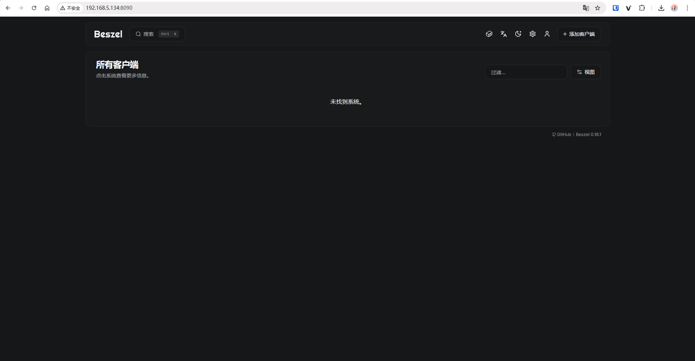
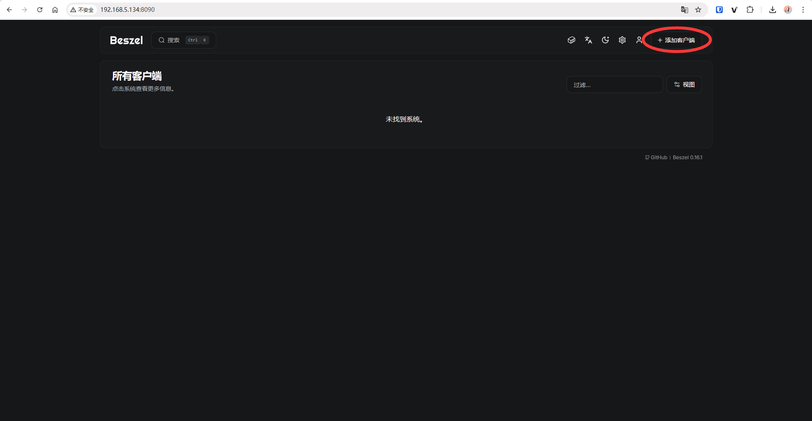
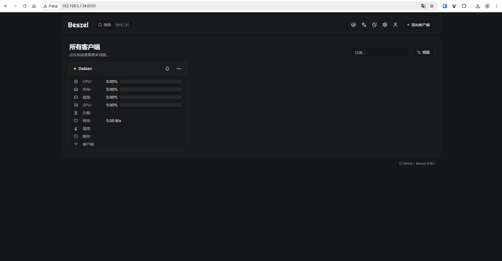

# Beszel 服务器监控平台

Beszel 是一个轻量级的服务器监控平台，包含 Docker 统计信息、历史数据和警报功能。它拥有友好的 Web 界面、简单的配置，并且开箱即用。它支持自动备份、多用户、OAuth 身份验证和 API 访问。支持中文语言。

## 功能特性

- **轻量级**：比主要解决方案更小，资源占用更少
- **简单**：易于设置，无需公网暴露
- **Docker 统计**：跟踪每个容器的 CPU、内存和网络使用历史
- **警报**：可配置 CPU、内存、磁盘、带宽、温度、负载平均值和状态的警报
- **多用户**：用户管理自己的系统。管理员可以在用户之间共享系统
- **OAuth / OIDC**：支持多种 OAuth2 提供程序。可以禁用密码验证
- **自动备份**：从磁盘或 S3 兼容的存储保存和恢复数据
- **电池**：主机系统电池电量

## 架构

Beszel 由两个主要组件组成：**中心 (hub)** 和 **代理 (agent)**。

- **中心 (hub)**：一个基于 PocketBase 构建的 Web 应用程序，提供用于查看和管理连接系统的仪表板
- **代理 (agent)**：在您要监控的每个系统上运行，并将系统指标传递给中心

## 屏幕截图


## 支持的指标

- **CPU 使用率** - 主机系统和 Docker / Podman 容器
- **内存使用率** - 主机系统和容器。包括交换分区和 ZFS ARC
- **磁盘使用率** - 主机系统。支持多个分区和设备
- **磁盘 I/O** - 主机系统。支持多个分区和设备
- **网络使用率** - 主机系统和容器
- **负载平均值** - 主机系统
- **温度** - 主机系统传感器
- **GPU 使用率 / 功耗** - Nvidia, AMD, 和 Intel
- **电池** - 主机系统电池电量

## 安装部署

为了方便大家理解和操作，这里安装分为两个步骤：第一步先进行 Hub 安装，第二步安装 Agent。

### 第一步：安装 Hub

#### 1. 创建目录

```bash
mkdir -p /opt/docker/beszel_data
cd /opt/docker/beszel_data
```

#### 2. 创建 docker-compose.yml 文件

```yaml
services:
  beszel:
    image: henrygd/beszel
    container_name: beszel
    restart: unless-stopped
    ports:
      - 8090:8090
    volumes:
      - /opt/docker/beszel_data:/beszel_data
```

#### 3. 启动容器

```bash
docker compose up -d
```

#### 4. 创建管理员用户

启动中心 (hub) 后，导航至 `http://localhost:8090` 或您选择的地址。系统将提示您创建帐户：


进入之后因为还未添加任何系统，所以界面是没有任何信息显示的：



### 第二步：安装 Agent

#### 1. 创建目录

```bash
mkdir -p /opt/docker/beszel_agent_data
cd /opt/docker/beszel_agent_data
```

#### 2. 添加客户端

回到在中心 (hub) 的 Web UI，右上角点击**添加客户端**：



配置信息：
- **名称**：`Debian`（可自定义）
- **主机/IP**：`/beszel_socket/beszel.sock`  
如果监控的是本机的，填写 `/beszel_socket/beszel.sock`；  
如果监控的是本机之外的直接填写 hub 服务 IP 地址。


#### 3. 配置 docker-compose.yml 文件

然后点击**复制 docker compose 文件**，将其粘贴到 `docker-compose.yml` 文件中，配置内容如下：

```yaml
services:
  beszel-agent:
    image: henrygd/beszel-agent
    container_name: beszel-agent
    restart: unless-stopped
    network_mode: host
    volumes:
      - /var/run/docker.sock:/var/run/docker.sock:ro
      - /opt/docker/beszel_agent_data:/var/lib/beszel-agent  # 自定义路径
      - /opt/docker/beszel_agent_data/beszel_socket:/beszel_socket  # 自定义路径
      # monitor other disks / partitions by mounting a folder in /extra-filesystems
      # - /mnt/disk/.beszel:/extra-filesystems/sda1:ro
    environment:
      LISTEN: /beszel_socket/beszel.sock
      HUB_URL: http://192.168.5.134:8090
      TOKEN: <令牌>  # 根据实际填写
      KEY: "<密钥>"  # 根据实际填写
```

#### 4. 完成添加

最后记得点击右下角的**添加客户端**，完成添加：

添加完成后暂时还是没有数据，因为 agent 还未启动，启动 agent 之后即可正常显示数据：



#### 5. 启动 Agent

```bash
docker compose up -d
```

> **提示**：关于 beszel-agent 的镜像选择：
> - 如果想实现 S.M.A.R.T. 监控，镜像要选择 `henrygd/beszel-agent:alpine`
> - 如果想实现 Intel GPU 监控，镜像要选择 `henrygd/beszel-agent-intel`（同时支持 S.M.A.R.T. 监控）
> - AMD GPU 和 Nvidia GPU 请前往官方文档查阅修改

## 高级配置

如果你想通过 agent 监测更多数据，比如每个磁盘分区容量使用情况、GPU 监控和 S.M.A.R.T. 监控，可以参考官方文档：https://beszel.dev/zh/guide/additional-disks

下面提供一下我使用的监控项部署参考配置（包含磁盘监控、S.M.A.R.T. 监控、GPU 监控）：

```yaml
services:
  beszel-agent:
    image: henrygd/beszel-agent-intel
    container_name: beszel-agent
    restart: unless-stopped
    network_mode: host
    volumes:
      - /var/run/docker.sock:/var/run/docker.sock:ro
      - /opt/docker/beszel_agent_data:/var/lib/beszel-agent  # 自定义路径
      - /opt/docker/beszel_agent_data/beszel_socket:/beszel_socket  # 自定义路径
      - /srv/volume_1:/extra-filesystems/volume_1:ro  # 自定义路径，但 /extra-filesystems 参数不可缺。监控磁盘用量
      - /srv/volume_2:/extra-filesystems/volume_2:ro  # 自定义路径，但 /extra-filesystems 参数不可缺。监控磁盘用量
    devices:
      - /dev/sda:/dev/sda  # S.M.A.R.T. 监控
      - /dev/sdb:/dev/sdb  # S.M.A.R.T. 监控
      - /dev/sdc:/dev/sdc  # S.M.A.R.T. 监控
      - /dev/sdd:/dev/sdd  # S.M.A.R.T. 监控
      - /dev/dri/card0:/dev/dri/card0  # GPU 监控
    cap_add:
      - SYS_RAWIO  # S.M.A.R.T. 监控
      - CAP_PERFMON  # GPU 监控
    environment:
      LISTEN: /beszel_socket/beszel.sock
      HUB_URL: http://192.168.5.134:8090
      TOKEN: <令牌>  # 根据实际填写
      KEY: "<密钥>"  # 根据实际填写
```

## 远程监控

如需监控内网或者其他远程主机，只需要在这些主机上安装 beszel-agent 即可，并根据所需监控项目适当调整 beszel-agent 的 docker compose 配置文件。

## 更多资源

- **官方文档**：https://beszel.dev/
