# Docker Compose 部署 Grafana + Prometheus + Node Exporter

Grafana 是一款开源的数据可视化与监控平台，可借助灵活的仪表板展示来自 Prometheus、InfluxDB、Elasticsearch、Graphite 等多种数据源的指标。本教程演示如何使用 Docker Compose 快速部署 Grafana、Prometheus 与 Node Exporter，实现主机监控与数据可视化。

---

## 1. 创建 `docker-compose.yml`

```yaml
version: '3.8'

networks:
  monitoring:
    driver: bridge

services:
  node-exporter:
    image: prom/node-exporter:latest
    container_name: node-exporter
    restart: unless-stopped
    user: root
    volumes:
      - /proc:/host/proc:ro
      - /sys:/host/sys:ro
      - /:/rootfs:ro
    command:
      - '--path.procfs=/host/proc'
      - '--path.rootfs=/rootfs'
      - '--path.sysfs=/host/sys'
      - '--collector.filesystem.mount-points-exclude=^/(sys|proc|dev|host|etc)($$|/)'
    network_mode: host

  prometheus:
    image: prom/prometheus:latest
    container_name: prometheus
    restart: unless-stopped
    user: root
    volumes:
      - /opt/docker/grafana/prometheus.yml:/etc/prometheus/prometheus.yml    # ← 可自定义映射路径
      - /opt/docker/grafana/prometheus_data:/prometheus                      # ← 可自定义数据目录
    command:
      - '--config.file=/etc/prometheus/prometheus.yml'
      - '--storage.tsdb.path=/prometheus'
      - '--web.console.libraries=/etc/prometheus/console_libraries'
      - '--web.console.templates=/etc/prometheus/consoles'
      - '--web.enable-lifecycle'
    ports:
      - 9095:9090                                                            # ← 可自定义映射端口
    networks:
      - monitoring

  grafana:
    image: grafana/grafana
    container_name: grafana
    restart: unless-stopped
    user: root
    ports:
      - 3005:3000                                                            # ← 可自定义映射端口
    volumes:
      - /opt/docker/grafana/grafana:/var/lib/grafana                         # ← 可自定义数据目录
    depends_on:
      - prometheus
    networks:
      - monitoring
```

> `node-exporter` 的挂载建议保持默认；`prometheus`、`grafana` 的映射路径与端口可按需调整。

---

## 2. 创建 `prometheus.yml`

```yaml
global:
  scrape_interval: 15s

scrape_configs:
  - job_name: 'prometheus'
    scrape_interval: 15s
    static_configs:
      - targets: ['192.168.5.10:9095']

  - job_name: 'node'
    static_configs:
      - targets: ['192.168.5.10:9100']
```

将 IP 地址替换为你自己的主机地址。

---

## 3. 准备配置目录

创建用于存放配置与数据的目录（示例：`/opt/docker/grafana`），并放置上述两个配置文件。目录结构参考：

```
/opt/docker/grafana/
├── docker-compose.yml
└── prometheus.yml
```

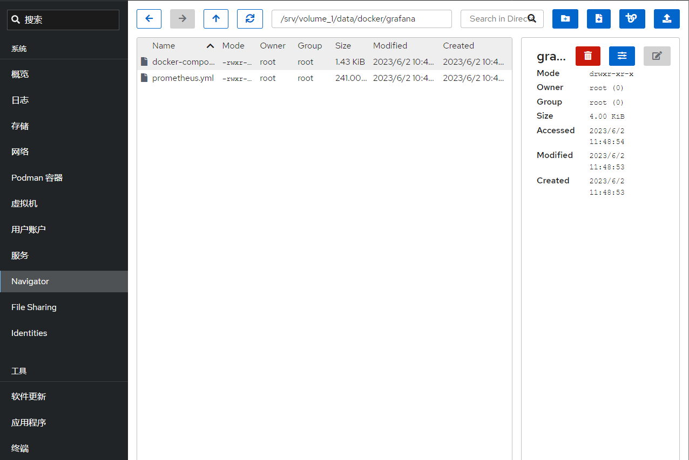

---

## 4. 启动服务

```bash
cd /opt/docker/grafana
docker compose up -d
```

容器启动成功后，可看到所有服务处于 `Up` 状态。

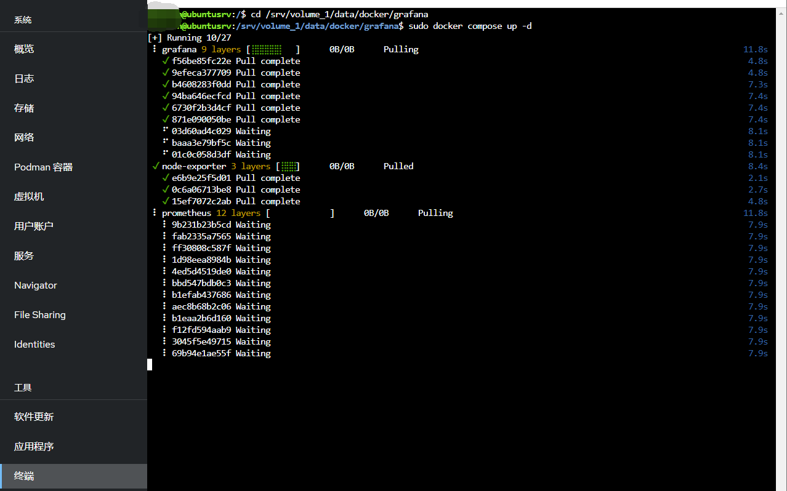

---

## 5. 验证服务

### Grafana

- 地址：`http://192.168.5.10:3005`
- 默认账号/密码：`admin / admin`（首次登录需修改密码）


### Prometheus

- 地址：`http://192.168.5.10:9095`

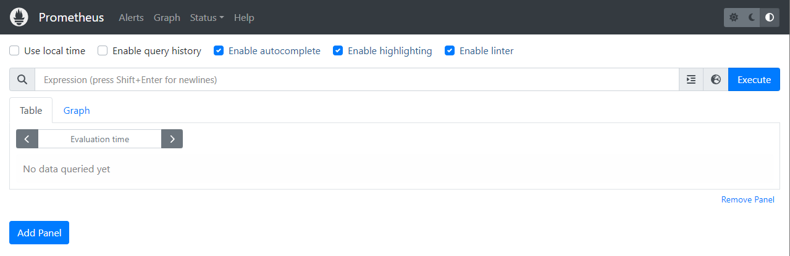

- 进入 **Status → Targets** 查看采集状态

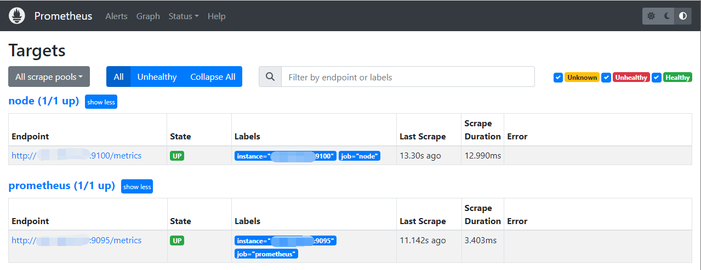

### Node Exporter

- 地址：`http://192.168.5.10:9100`
- 点击 **Metrics** 查看详细指标

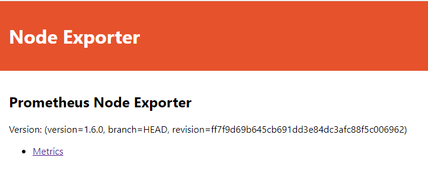

---

## 6. 配置 Grafana 数据源与仪表板

### 6.1 添加 Prometheus 数据源

1. 左上角菜单 → **Administration → Data sources**

   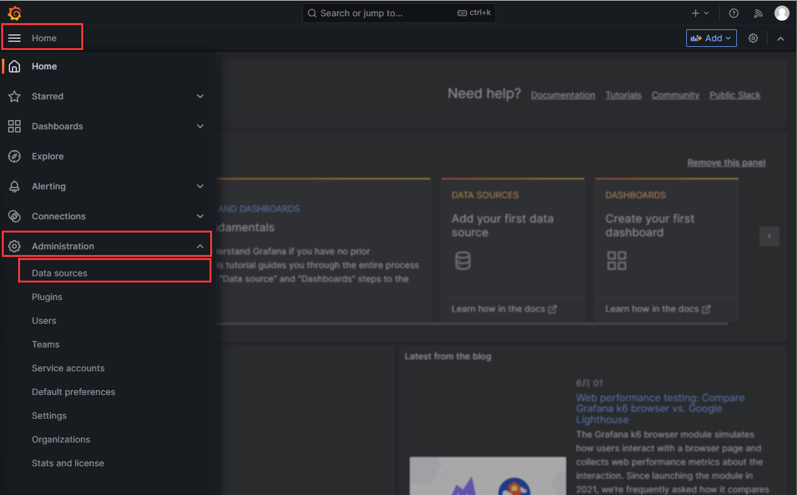

2. 点击 **Add data sources**

   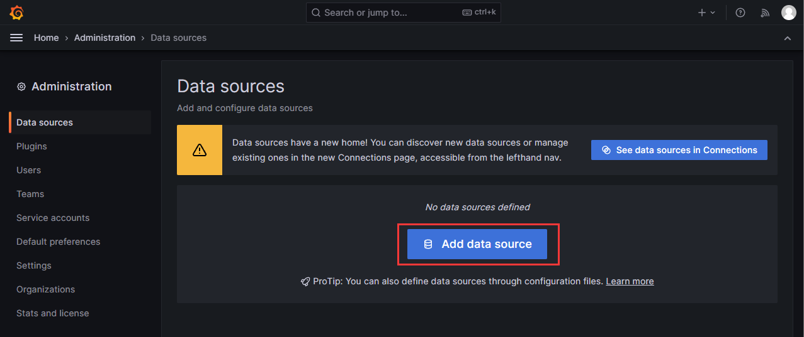

3. 选择 **Prometheus**

   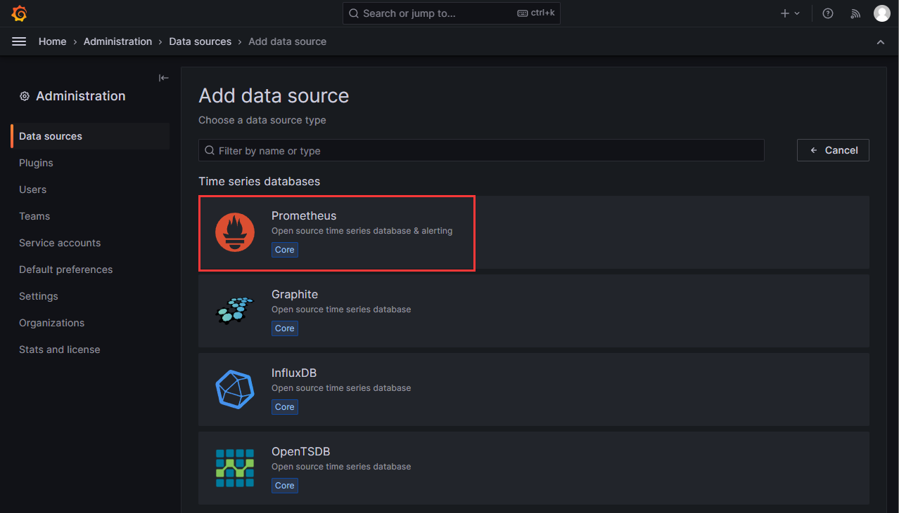

4. 填写参数：

   - **Name**：`Prometheus`（可自定义）
   - **URL**：`http://192.168.5.10:9095`

   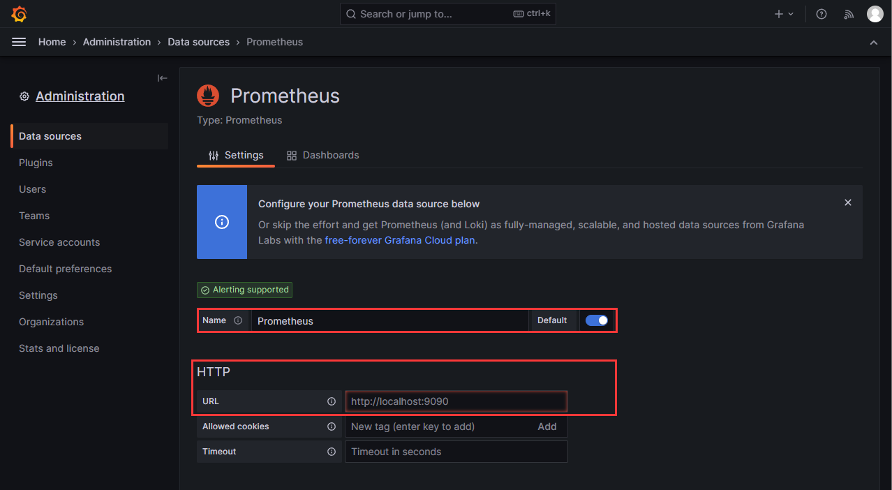

5. 滚动到底部，点击 **Save & test**

   

### 6.2 导入仪表板

1. 左上角菜单 → **Dashboards**

   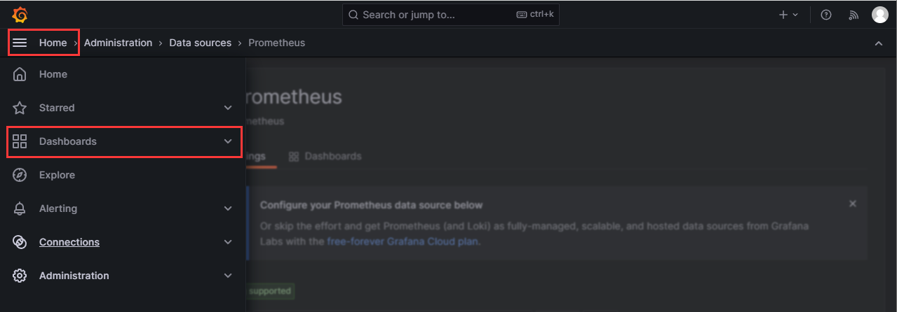

2. 点击 **New → Import**

   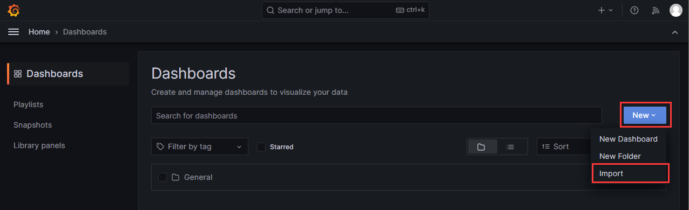

3. 输入仪表板 ID（推荐：`12633`、`8919`、`1860`），点击 **Load**

   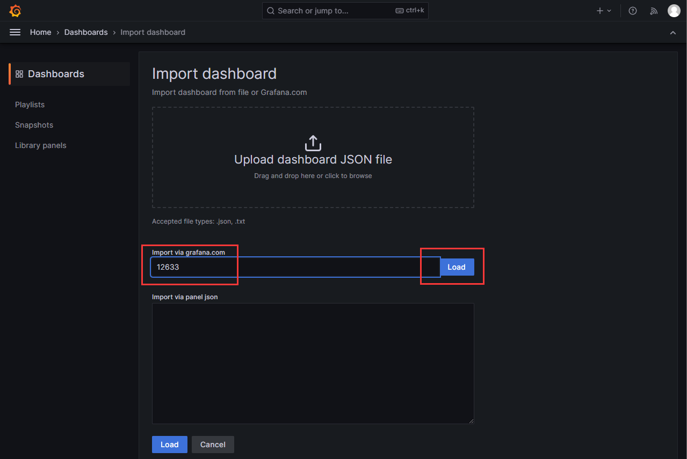

4. 选择刚配置好的 Prometheus 数据源，点击 **Import**

   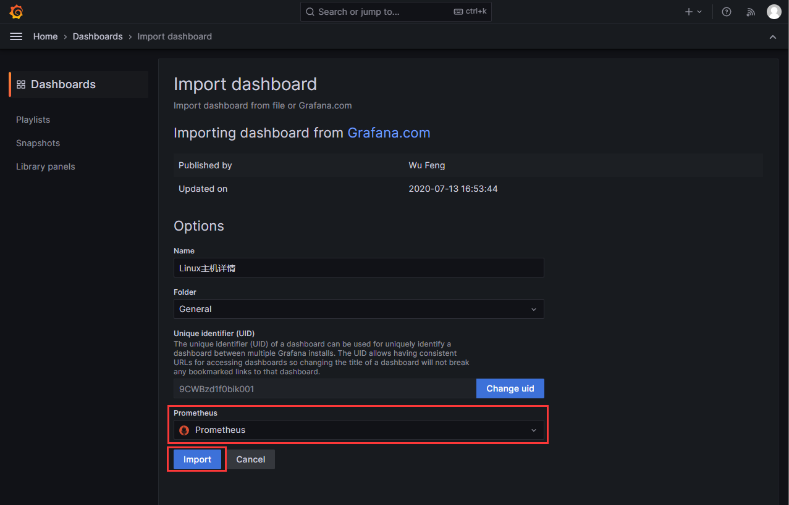

5. 仪表板导入成功，可直接查看监控大盘

   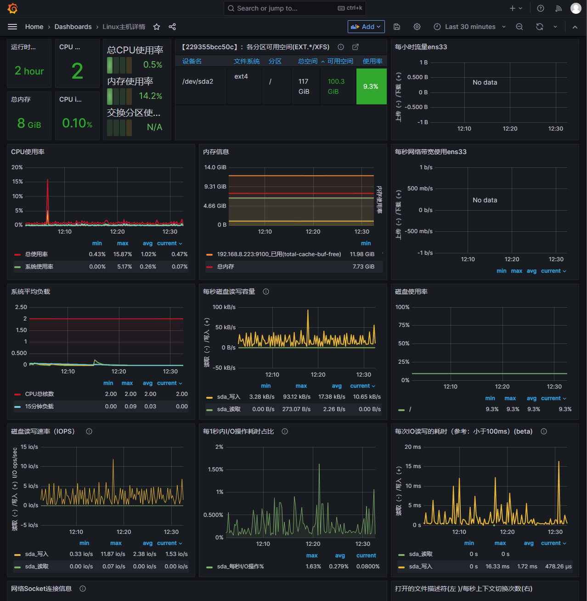

---

## 7. 常用地址汇总

- Grafana：`http://192.168.5.10:3005`
- Prometheus：`http://192.168.5.10:9095`
- Node Exporter：`http://192.168.5.10:9100`

（请根据实际 IP 与端口替换。）

---

## 参考资料

- 官方文档：<https://grafana.com/docs/grafana-cloud/quickstart/docker-compose-linux/>
- 仪表板下载：<https://grafana.com/grafana/dashboards/?plcmt=footer&collector=nodeexporter>
