# 虚拟机安装 ImmortalWrt 教程

> 适用于在 DebNAS 主机上通过 Cockpit 创建 ImmortalWrt 虚拟机，并将其配置为旁路由使用。

## 1. 简介

- ImmortalWrt 是OpenWrt的一个分支，移植了更多软件包，支持更多设备，并针对中国大陆用户优化了默认配置文件和本地化。与上游相比，我们允许用户使用（无法合并到上游的）修改/技巧来提供更好的功能、性能和支持。
- 默认登录地址 `http://192.168.1.1` 或 `http://immortalwrt.lan`，用户名 `root`、密码为空。
- 官方仓库：<https://github.com/immortalwrt/immortalwrt>
- 官方镜像：<https://downloads.immortalwrt.org>
- 本文示例基于 Stable Release 24.10.4（x86_64，EFI 启动）。

## 2. 下载并校验镜像

### 2.1 获取官方镜像

访问官方下载页，选择最新的 Stable Release。

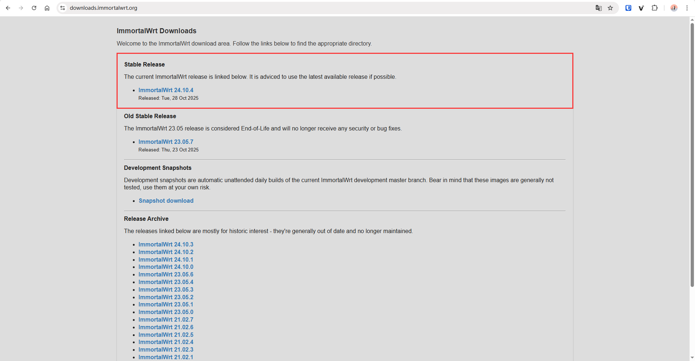

依次选择 `x86` -> `64` -> `generic-ext4-combined-efi.qcow2.gz`，右键复制下载链接。

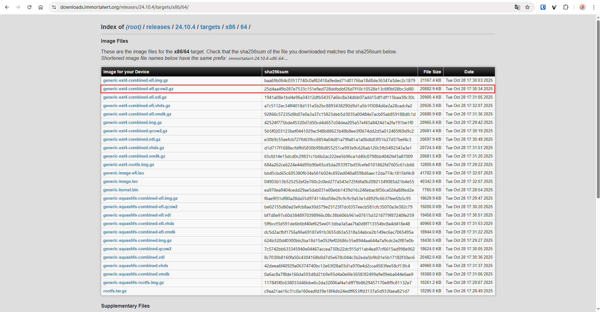

### 2.2 拉取镜像文件

1. 进入镜像存放目录（示例使用 `/srv/os`）：

   ```bash
   cd /srv/os
   ```

2. 以 root 身份执行下载命令（普通用户请在命令前加 `sudo`，镜像地址为刚刚复制的）：

   ```bash
   sudo wget https://downloads.immortalwrt.org/releases/24.10.4/targets/x86/64/immortalwrt-24.10.4-x86-64-generic-ext4-combined-efi.qcow2.gz
   ```

如果官方源速度较慢，可改用国内镜像：

> 南京大学开源镜像站：<https://mirror.nju.edu.cn/immortalwrt>  
> 北京大学开源镜像站：<https://mirrors.pku.edu.cn/immortalwrt>  
> 中国科学技术大学开源软件镜像站：<https://mirrors.ustc.edu.cn/immortalwrt>  
> SJTUG 致远镜像站：<https://mirrors.sjtug.sjtu.edu.cn/immortalwrt>  
> 浙江大学开源软件镜像站：<https://mirrors.zju.edu.cn/immortalwrt>  
> 吉林大学开源镜像站：<https://mirrors.jlu.edu.cn/immortalwrt>

### 2.3 校验与解压

（可选）校验 SHA256，确认文件完整性：
> 注意文件路径和HASH值按实填写。

```bash
FILE="/srv/os/immortalwrt-24.10.4-x86-64-generic-ext4-combined-efi.qcow2.gz"
HASH="25d4aa49b287e7533c151e9ed728ddbdbf26d7f10c10528e13c6f0bf28bc3d80"
echo "$HASH  $FILE" | sha256sum -c -
```

输出 `OK` 即表示校验通过。


解压镜像：

```bash
sudo gunzip immortalwrt-24.10.4-x86-64-generic-ext4-combined-efi.qcow2.gz
```

若需保留 `.gz` 原文件，可改用：

```bash
sudo gzip -dk immortalwrt-24.10.4-x86-64-generic-ext4-combined-efi.qcow2.gz
```

## 3. 在 Cockpit 中导入虚拟机

1. 打开 Cockpit -> 虚拟机 -> **导入 VM**。
2. 填写主机名称、选择上一步下载的 `.qcow2` 文件（示例路径 `/srv/os`）。
3. 操作系统类型可选 “Debian 13”，内存/CPU 按需分配。
4. 点击 **导入并编辑**，确认配置后保存。

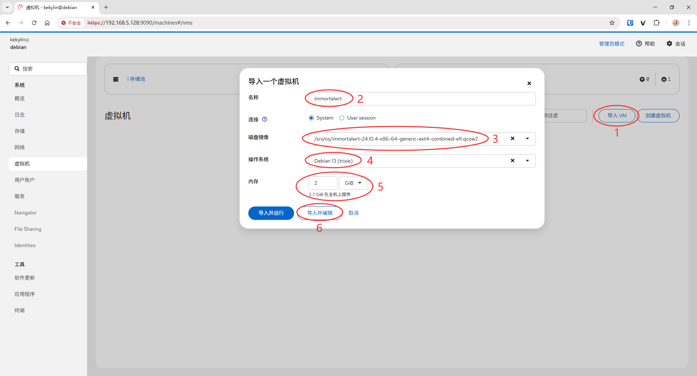

导入完成后启动虚拟机，进入控制台按回车获取 shell。

### 3.1 修改 LAN 地址

ImmortalWrt 默认 LAN IP 为 `192.168.1.1`，建议改成局域网内未占用的新地址：

```bash
vi /etc/config/network
```

在 `config interface 'lan'` 段落中，调整 `option ipaddr` 为期望地址（如 `192.168.5.10`），保存后重启：

```bash
reboot now
```

> 需要关闭虚拟机时，正确的关机命令：`poweroff now`。不支持 `shutdown now`命令。

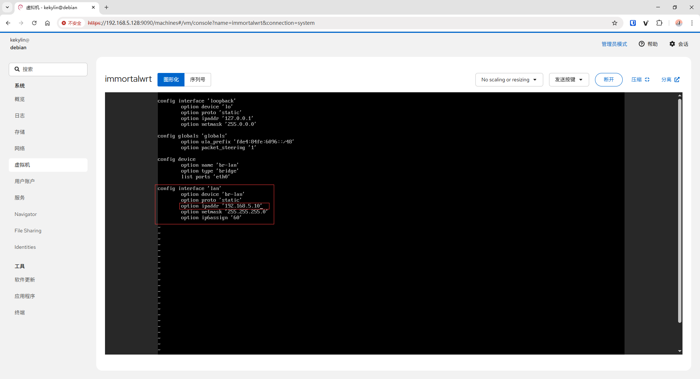

## 4. 配置旁路由模式

### 4.1 登录 Web 管理界面

在浏览器访问前一步设置的 LAN 地址（示例 `http://192.168.5.10`），首次登录无需密码，可立即设置管理员密码。


### 4.2 调整 LAN 接口

依次进入 **网络 -> 接口 -> LAN -> 编辑**。

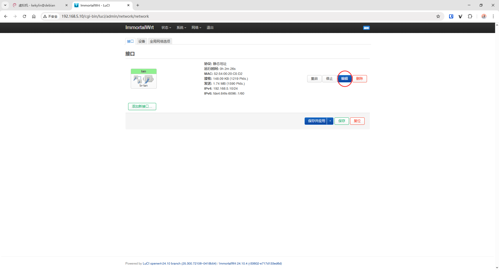

1. **基本设置**：IPv4 地址保持自定义的旁路由 IP。
2. **IPv4 网关**：填写主路由地址（示例 `192.168.5.1`）。

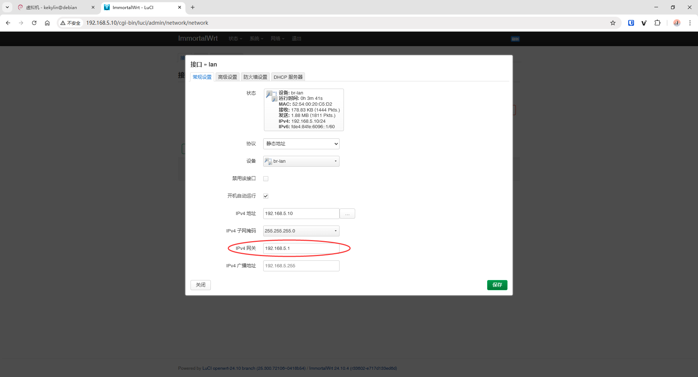

3. **高级设置 -> 使用自定义的 DNS 服务器**：添加常用 DNS（示例 `223.5.5.5`）。

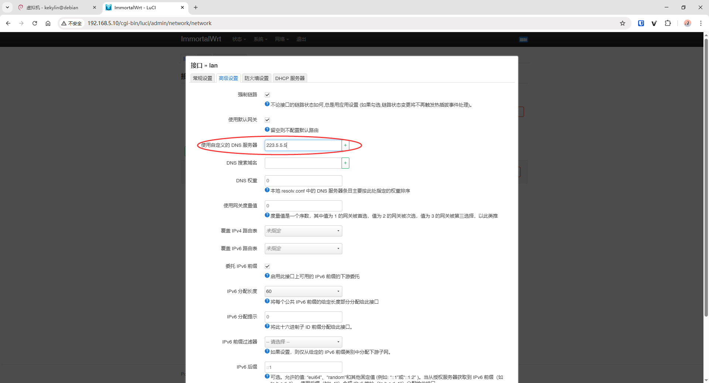

4. **DHCP 服务器 -> 常规设置**：勾选 “忽略此接口”。

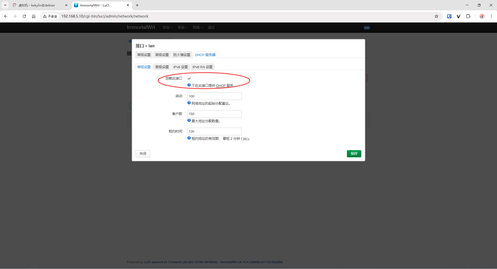

5. **IPv6 设置 -> RA 服务器**：调整为 “已禁用”，其余保持默认。

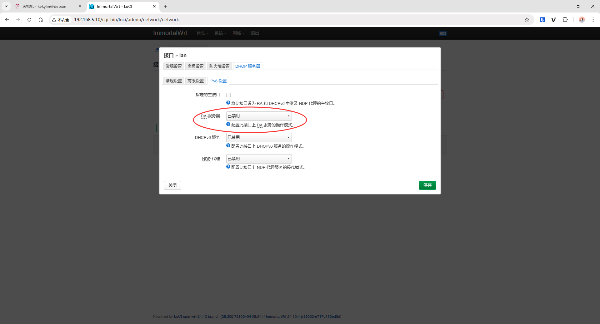

6. 依次点击 **保存** 与 **保存并应用**，等待配置生效。

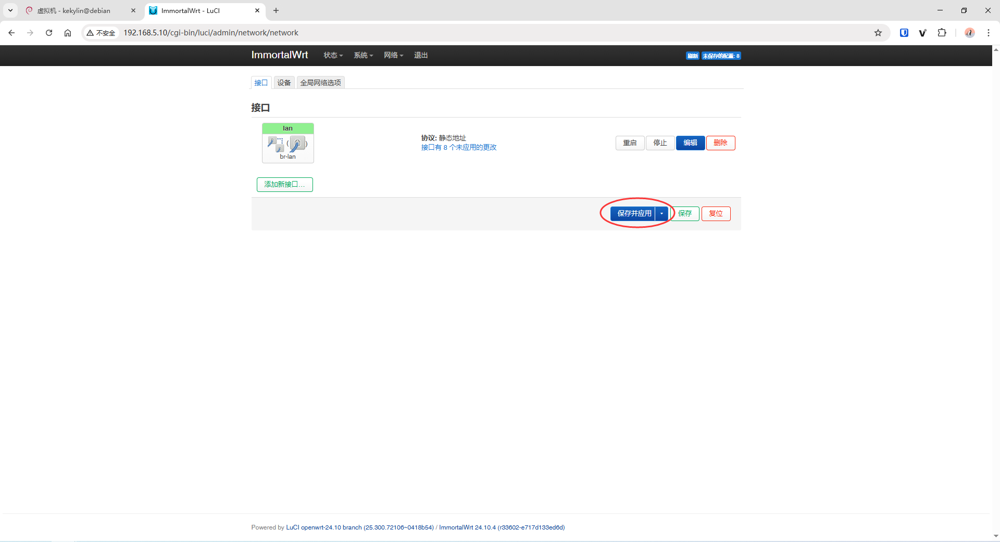

## 5. 安装 OpenClash 插件

1. 打开 **系统 -> 软件包 -> 更新列表** 刷新索引。

   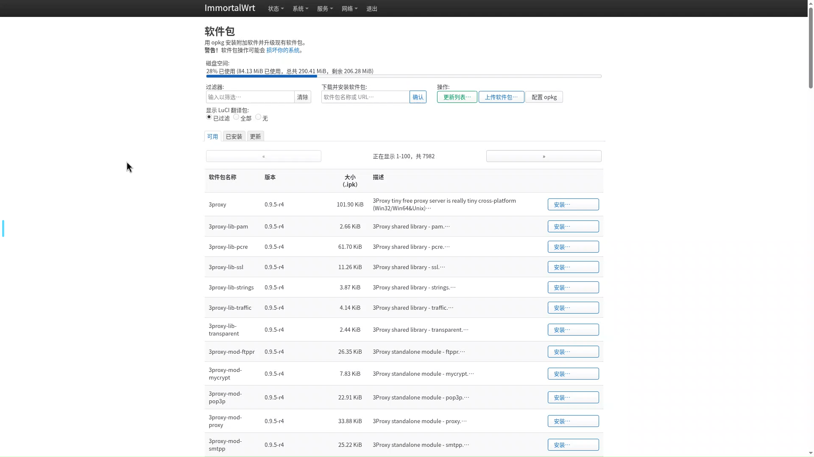

2. 在过滤器中输入 `clash`，安装 `luci-app-openclash` 及依赖。（这里我已经安装，就不重复演示了。）
   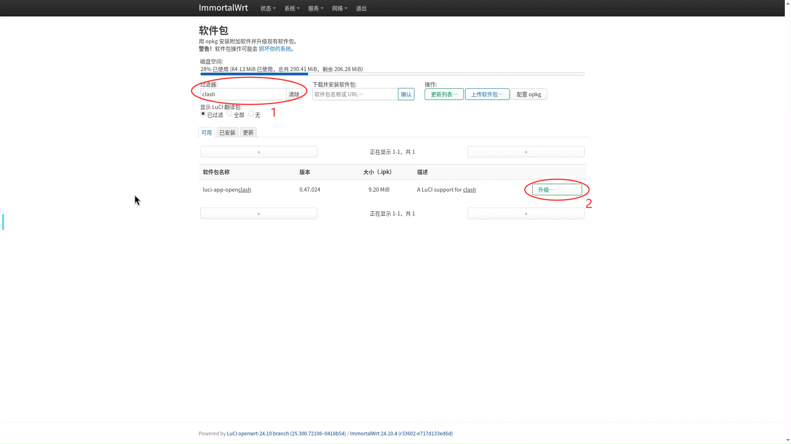

3. 安装完成后重启系统，即可在 “服务” 菜单看到 OpenClash。

## 6. 配置 OpenClash

### 6.1 下载核心

首次进入 OpenClash 会提示下载内核，选择延迟最低的镜像源即可。

### 6.2 添加订阅并启用

1. 进入 **配置订阅 -> 添加**，粘贴机场提供的 Clash 订阅地址，保存。

   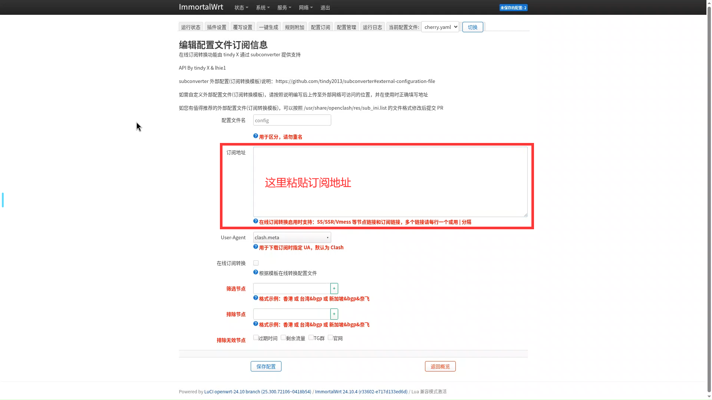

2. 返回配置列表，点击 **更新** -> **保存配置**。

   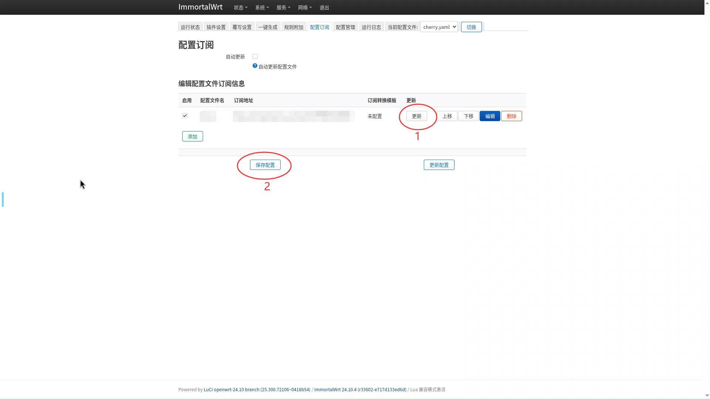

3. 切换到 **运行状态**，确认节点、流量等信息正常。

   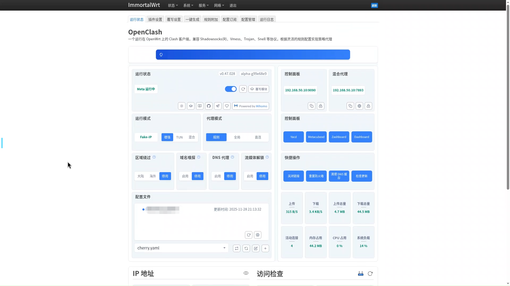

### 6.3 认证信息与代理说明

- 默认生成的本地代理带有用户名/密码，可按需在 **覆写设置 -> 设置 SOCKS5/HTTP(S) 认证信息** 中修改或删除。

  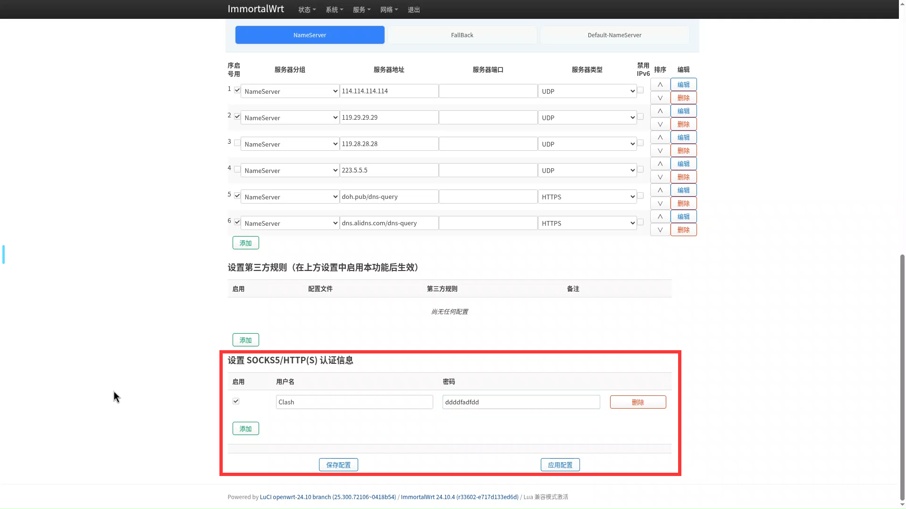

- 需要将该代理提供给 Docker 或其他程序时，请参考《[Debian 为 Docker 添加代理指引](/docker/add-a-proxy/)》，了解 CLI/daemon/容器运行期的标准配置方式。

配置完成后，ImmortalWrt 已以旁路由模式接入网络，可在主路由中为需要走代理的客户端手动指定网关即可接入 ImmortalWrt。