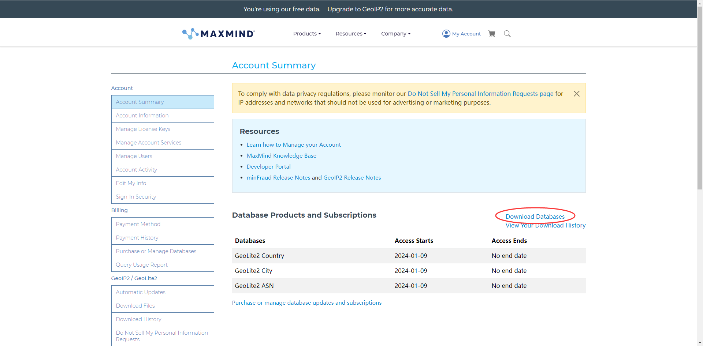
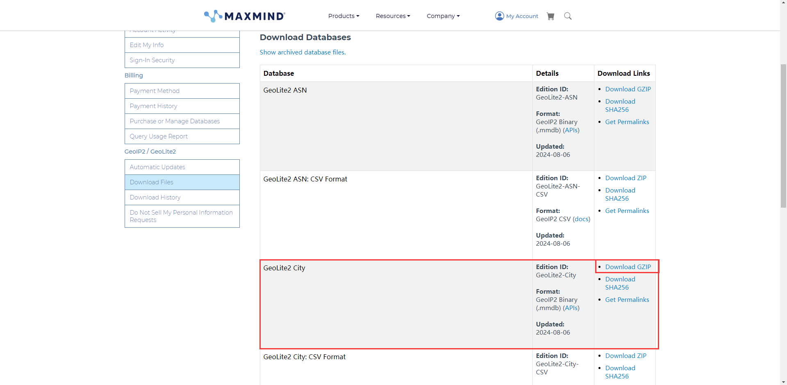
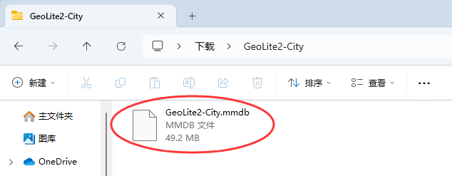
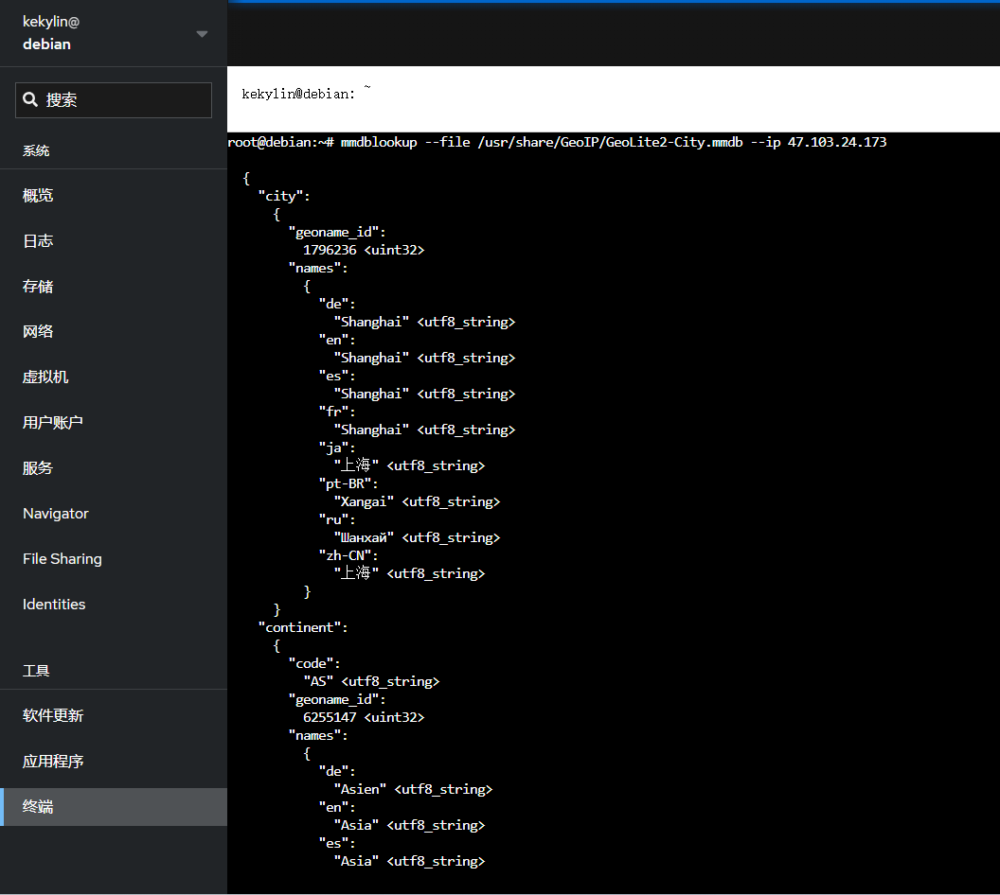
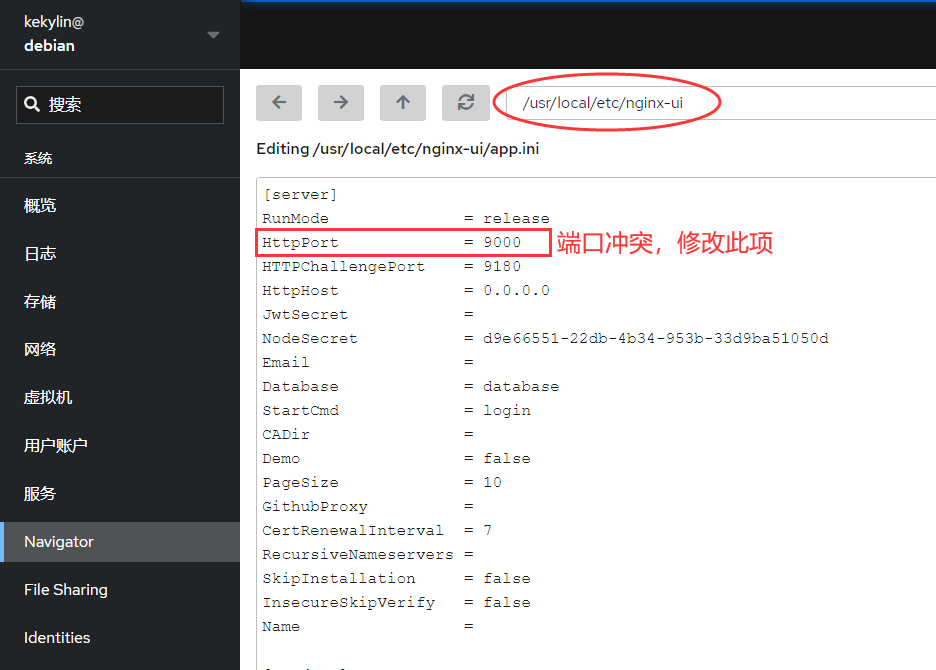
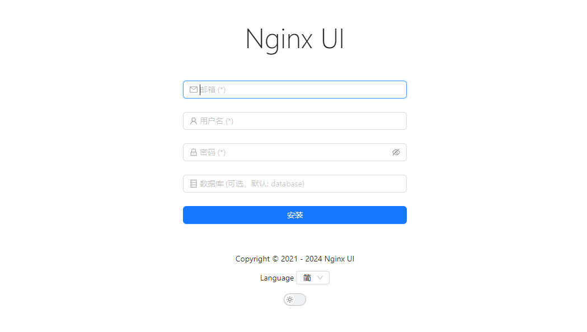
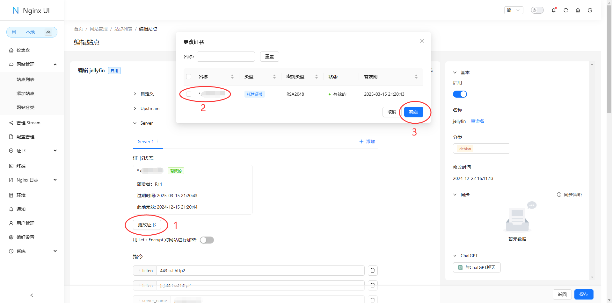

# Nginx反代限制国外IP访问教程

## 一、安装Nginx、GeoIP2
1、执行Nginx、GeoIP2安装命令：
```bash
apt install -y nginx-full mmdb-bin
```
2、验证是否已成功安装，执行命令：
```bash
nginx -v
nginx -V 2>&1 | ls /usr/lib/nginx/modules/ | grep geoip2
```
3、返回成功结果：
```bash
nginx version: nginx/1.22.1
ngx_http_geoip2_module.so
ngx_stream_geoip2_module.so
```

## 二、下载IP地址定位数据库
1、GeoLite2是一个免费的IP地址定位数据库,用户可以免费地使用其中的数据。下载IP地址定位数据库文件需要登陆官网进行下载，没有账号的朋友需要先行注册账号。
> GeoLite2官网：  
https://www.maxmind.com/  
GeoLite2注册地址：  
https://www.maxmind.com/en/geolite2/signup  
注册教程：  
http://modsecurity.cn/practice/post/15.html  

2、登陆官网后，点击右下角的“Download Databases”


3、下拉找到“GeoLite2 City”，点击“Download ZIP”下载。


4、将下载好的数据库文件压缩包解压，解压后得到“GeoLite2-City.mmdb”文件


5、将“GeoLite2-City.mmdb”文件上传至刚刚安装Nginx的服务器，存放在“/usr/share/GeoIP/”路径下。


6、验证地理数据库是否已生效，验证IP地址可以填写自己网络的IP地址。
```bash
mmdblookup --file /usr/share/GeoIP/GeoLite2-City.mmdb --ip 47.103.24.173
```
成功返回IP地址信息


## 三、安装Nginx图形化管理工具——Nginx-UI
Nginx UI 是一个全新的 Nginx 网络管理界面，旨在简化 Nginx 服务器的管理和配置。它提供实时服务器统计数据、ChatGPT 助手、一键部署、Let's Encrypt 证书的自动续签以及用户友好的网站配置编辑工具。此外，Nginx UI 还提供了在线访问 Nginx 日志、配置文件的自动测试和重载、网络终端、深色模式和自适应网页设计等功能。Nginx UI 采用 Go 和 Vue 构建，确保在管理 Nginx 服务器时提供无缝高效的体验。
> 项目地址：https://github.com/0xJacky/nginx-ui  
项目官网：https://nginxui.com/zh_CN/  

1、一键安装脚本命令：
注意需要用root权限执行。
```bash
bash <(curl -L -s https://mirror.ghproxy.com/https://raw.githubusercontent.com/0xJacky/nginx-ui/master/install.sh) install -r https://mirror.ghproxy.com/
```
2、修改Nginx-UI默认端口
一键安装脚本默认设置的监听端口为 9000，HTTP Challenge 端口默认为 9180。如果有端口冲突，请手动修改 /usr/local/etc/nginx-ui/app.ini 配置文件， 并使用 systemctl restart nginx-ui 重启 Nginx UI 服务。没有端口冲突问题，则直接跳过此步骤。


3、登陆使用Nginx-UI
第一次运行 Nginx UI 时，请在浏览器中访问` http://<your_server_ip>:<listen_port>/install `完成后续配置。邮箱地址必须真实有效，后期自动续签SSL证书需要用到。用户名及密码自定义，数据库项留空。


## 四、限制国外IP访问
1、修改`nginx.conf`配置文件  
直接复制下面配置参数，替换掉你原有的`nginx.conf`配置参数，只需要修改配置中的内网IP地址段，将其修改为你的内网IP地址段。  
```bash
    # 创建允许访问的 IP 变量
    geo $allow_ip {
        default 0;  # 默认拒绝
        192.168.8.0/24 1;  # 允许内网IP段 192.168.8.0/24
    }
```
在替换之前，请先备份，避免出错。  
备份命令：
```bash
sudo cp /etc/nginx/nginx.conf /etc/nginx/nginx.conf.bak
```
`nginx.conf`配置参数
```bash
user www-data;
worker_processes auto;
pid /run/nginx.pid;
error_log /var/log/nginx/error.log;
include /etc/nginx/modules-enabled/*.conf;

events {
	worker_connections 768;
	# multi_accept on;
}

http {
    charset utf-8;

    # 基本的性能调优项
    sendfile on;
    tcp_nopush on;
    tcp_nodelay on;
    server_tokens off;
    log_not_found off;

    # 默认类型和 MIME 类型
    include /etc/nginx/mime.types;
    default_type application/octet-stream;

    # 超时设置
    client_header_timeout 10s;
    client_body_timeout 60s;
    send_timeout 60s;
    keepalive_timeout 65s 20s;

    # 缓存设置
    client_max_body_size 16m;
    server_names_hash_max_size 8192;
    server_names_hash_bucket_size 128;

    # 请求缓冲
    proxy_request_buffering off;
    fastcgi_request_buffering off;
    scgi_request_buffering off;
    proxy_buffering off;
    fastcgi_buffering off;
    scgi_buffering off;

    # 设置 DNS 解析超时时间
    resolver_timeout 5s;

    # 日志格式和日志文件设置
    log_format json_analytics escape=json '{'
    '"msec": "$msec", '
    '"connection": "$connection", '
    '"connection_requests": "$connection_requests", '
    '"pid": "$pid", '
    '"request_id": "$request_id", '
    '"request_length": "$request_length", '
    '"remote_addr": "$remote_addr", '
    '"remote_user": "$remote_user", '
    '"remote_port": "$remote_port", '
    '"time_local": "$time_local", '
    '"time_iso8601": "$time_iso8601", '
    '"request": "$request", '
    '"request_uri": "$request_uri", '
    '"args": "$args", '
    '"status": "$status", '
    '"body_bytes_sent": "$body_bytes_sent", '
    '"bytes_sent": "$bytes_sent", '
    '"http_referer": "$http_referer", '
    '"http_user_agent": "$http_user_agent", '
    '"http_x_forwarded_for": "$http_x_forwarded_for", '
    '"http_host": "$http_host", '
    '"server_name": "$server_name", '
    '"request_time": "$request_time", '
    '"upstream": "$upstream_addr", '
    '"upstream_connect_time": "$upstream_connect_time", '
    '"upstream_header_time": "$upstream_header_time", '
    '"upstream_response_time": "$upstream_response_time", '
    '"upstream_response_length": "$upstream_response_length", '
    '"upstream_cache_status": "$upstream_cache_status", '
    '"ssl_protocol": "$ssl_protocol", '
    '"ssl_cipher": "$ssl_cipher", '
    '"scheme": "$scheme", '
    '"request_method": "$request_method", '
    '"server_protocol": "$server_protocol", '
    '"pipe": "$pipe", '
    '"gzip_ratio": "$gzip_ratio", '
    '"http_cf_ray": "$http_cf_ray",'
    '"geoip_country_code": "$geoip2_data_country_code", '
    '"geoip_country_name": "$geoip2_data_country_name", '
    '"geoip_city_name": "$geoip2_data_city_name"'
    '}';

    # 设置访问日志，使用 JSON 格式记录
    access_log /var/log/nginx/access.log json_analytics;

    geoip2 /usr/share/GeoIP/GeoLite2-City.mmdb {
        $geoip2_data_country_code country iso_code; #字符显示国家
        $geoip2_data_city_name city names zh-CN; #中文显示城市名
        $geoip2_data_country_name country names zh-CN; #中文显示国家名    
    }
    
    # 创建允许访问的 IP 变量
    geo $allow_ip {
        default 0;  # 默认拒绝
        192.168.8.0/24 1;  # 允许内网IP段 192.168.8.0/24
    }
    # 判断是否为中国IP，如果是，则允许访问
    map $geoip2_data_country_code $allow_ip_country {
        default 0;
        CN 1;
    }
    # 中国IP或者内网IP满足其中一个，则允许访问
    map $allow_ip $final_allow_ip {
        1  1;
        0  $allow_ip_country;
    }
    
    # Real IP 配置项
    real_ip_header X-Forwarded-For;
    real_ip_recursive on;
    set_real_ip_from 127.0.0.1;

    # SSL 会话配置
    ssl_session_timeout 3600s;  # 会话超时设置
    ssl_session_cache shared:SSL:1m;  # 会话缓存设置
    ssl_session_tickets off;  # 禁用会话票据

    # SSL 协议和加密套件配置
    ssl_protocols TLSv1.2 TLSv1.3;
    ssl_ciphers ECDHE-ECDSA-AES128-GCM-SHA256:ECDHE-RSA-AES128-GCM-SHA256:ECDHE-ECDSA-AES256-GCM-SHA384:ECDHE-RSA-AES256-GCM-SHA384:ECDHE-ECDSA-CHACHA20-POLY1305:ECDHE-RSA-CHACHA20-POLY1305:DHE-RSA-AES128-GCM-SHA256:DHE-RSA-AES256-GCM-SHA384;
    ssl_prefer_server_ciphers on;  # 优先使用服务器端配置的加密套件

    # SSL Stapling 配置项
    ssl_stapling on;
    ssl_stapling_verify on;

    # 升级连接映射（WebSocket）
    map $http_upgrade $connection_upgrade {
        default upgrade;
        "" close;
    }

    # 转发请求的代理头设置
    map $remote_addr $proxy_forwarded_elem {
        ~^[0-9.]+$ "for=$remote_addr";
        ~^[0-9A-Fa-f:.]+$ "for=\"[$remote_addr]\"";
        default "for=unknown";
    }

    # 转发头设置
    map $http_forwarded $proxy_add_forwarded {
        "~^(,[ \\t]*)*([!#$%&'*+.^_`|~0-9A-Za-z-]+=([!#$%&'*+.^_`|~0-9A-Za-z-]+|\"([\\t \\x21\\x23-\\x5B\\x5D-\\x7E\\x80-\\xFF]|\\\\[\\t \\x21-\\x7E\\x80-\\xFF])*\"))?(;([!#$%&'*+.^_`|~0-9A-Za-z-]+=([!#$%&'*+.^_`|~0-9A-Za-z-]+|\"([\\t \\x21\\x23-\\x5B\\x5D-\\x7E\\x80-\\xFF]|\\\\[\\t \\x21-\\x7E\\x80-\\xFF])*\"))?)*([ \\t]*,([ \\t]*([!#$%&'*+.^_`|~0-9A-Za-z-]+=([!#$%&'*+.^_`|~0-9A-Za-z-]+|\"([\\t \\x21\\x23-\\x5B\\x5D-\\x7E\\x80-\\xFF]|\\\\[\\t \\x21-\\x7E\\x80-\\xFF])*\"))?(;([!#$%&'*+.^_`|~0-9A-Za-z-]+=([!#$%&'*+.^_`|~0-9A-Za-z-]+|\"([\\t \\x21\\x23-\\x5B\\x5D-\\x7E\\x80-\\xFF]|\\\\[\\t \\x21-\\x7E\\x80-\\xFF])*\"))?)*)?)*$" "$http_forwarded, $proxy_forwarded_elem";
        default "$proxy_forwarded_elem";
    }

    # Gzip 压缩配置
    gzip on;
    gzip_min_length 1000;
    gzip_types text/plain text/css text/xml application/json application/javascript application/rss+xml image/svg+xml;
    gzip_vary on;
    gzip_static on;
    gzip_proxied any;

    # 启用文件缓存
    open_file_cache max=1000 inactive=60s;
    open_file_cache_valid 3s;
    open_file_cache_min_uses 2;
    open_file_cache_errors on;
    
    # 引入额外的配置文件
    include /etc/nginx/conf.d/*.conf;
    # 引入启用的网站配置
    include /etc/nginx/sites-enabled/*;
}
```
2、修改`server.conf`配置文件
```bash
server {
    listen 443 ssl http2;
    listen [::]:443 ssl http2;

    # 设置访问域名
    server_name jellyfin.baidu.com;

    # SSL证书路径
    ssl_certificate /etc/nginx/ssl/*.baidu.com_2048/fullchain.cer;
    ssl_certificate_key /etc/nginx/ssl/*.baidu.com_2048/private.key;

    # 允许中国IP或内网IP，拒绝非允许的IP
    if ($final_allow_ip = 0) {
        return 444;
    }

    # 防止不匹配的 Host 头
    if ($host != $server_name) {
        return 444;
    }

    # 安全头配置
    ignore_invalid_headers off;
    add_header Strict-Transport-Security "max-age=31536000; includeSubDomains" always;
    add_header X-XSS-Protection "1; mode=block" always;
    add_header X-Content-Type-Options "nosniff" always;
    add_header Referrer-Policy "no-referrer-when-downgrade" always;
    add_header Permissions-Policy "interest-cohort=()" always;
    add_header X-Frame-Options "SAMEORIGIN";

     # 如有服务异常，请删除此行。比如为群晖DSM服务反代，保留此行则服务异常。
    add_header Content-Security-Policy "default-src 'self' http: https: ws: wss: data: blob: 'unsafe-inline'; frame-ancestors 'self';" always;

    # ACME证书验证路径
    location /.well-known/acme-challenge {
        proxy_set_header Host $host;
        proxy_set_header X-Real-IP $remote_addr;
        proxy_set_header X-Forwarded-For $remote_addr:$remote_port;
        proxy_pass http://127.0.0.1:9180;
    }

    location ~ ((^|/)\.|^.*\.yml$|^/sites/.*/private/|^/sites/[^/]+/[^/]*settings.*\.php$) {
        return 444;
    }
    location ~ ^/sites/[^/]+/files/.*\.php$ {
        return 444;
    }
    location ~ /vendor/.*\.php$ {
        return 444;
    }
    location ~* /(images|cache|media|logs|tmp)/.*\.(gz|tar|bzip2|7z|php|php5|php7|log|error|py|pl|kid|love|cgi|shtml|phps|pht|jsp|asp|sh|bash)$ {
        return 444;
    }

    location / {
        # 设置代理使用的 HTTP 版本
        proxy_http_version 1.1;
    
        # 处理 WebSocket 升级
        proxy_set_header Upgrade $http_upgrade;
        proxy_set_header Connection $connection_upgrade;

        # 限制上传文件大小
        client_max_body_size 16m;

        # 关闭代理的重定向
        proxy_redirect off;

        # 转发原始请求头
        proxy_set_header Host $host;
        proxy_set_header X-Real-IP $remote_addr;
        proxy_set_header X-Forwarded-For $proxy_add_x_forwarded_for;
        proxy_set_header X-Forwarded-Proto $scheme;

        # 转发请求到后端服务
        proxy_pass http://192.168.1.10:8096/;
    }
}
```

`server.conf`配置文件需要修改的内容总共就四个地方，如下所示：  
1、设置域名
```bash
# 设置访问域名
server_name jellyfin.baidu.com;
```

2、SSL证书路径
```bash
# SSL证书路径
ssl_certificate /etc/nginx/ssl/*.baidu.com_2048/fullchain.cer;
ssl_certificate_key /etc/nginx/ssl/*.baidu.com_2048/private.key;
```
替换证书可以通过Nginx-ui进行操作


3、设置需要反代的服务地址
```bash
# 转发请求到后端服务
proxy_pass http://192.168.1.10:8096/;
```
4、CSP设置，启用会导致个别服务异常，删除掉即可。启用是为了提高安全性。
```bash
# 如有服务异常，请删除此行。比如为群晖DSM服务反代，保留此行则服务异常。
add_header Content-Security-Policy "default-src 'self' http: https: ws: wss: data: blob: 'unsafe-inline'; frame-ancestors 'self';" always;

```
至此所有操作均已完成，不出意外的话，所有非国外IP均无法访问你的服务了。  
教程均为原创，转载请注明出处，谢谢！
