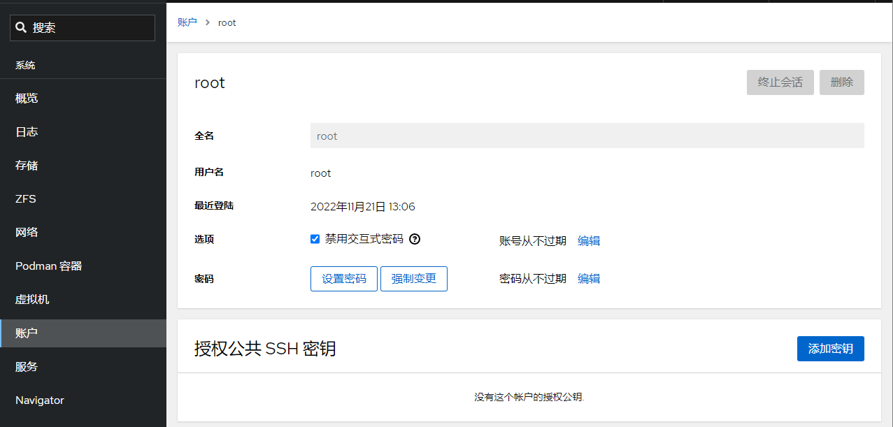
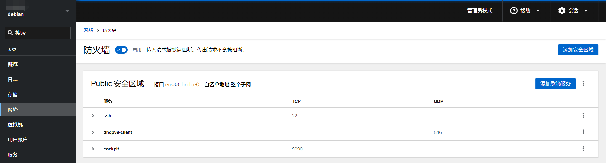
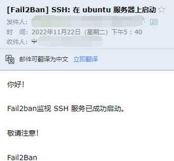
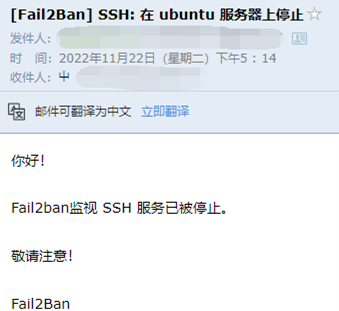
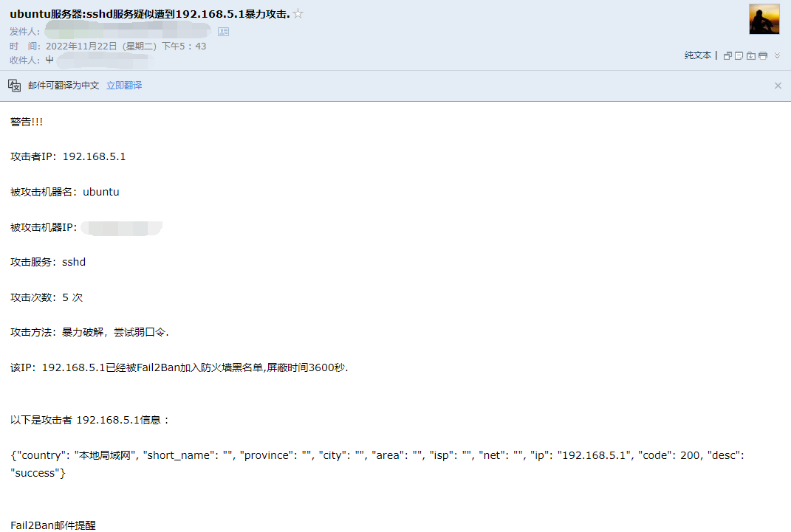

# 安全防护
安全的概念：

1、收紧安全措施有可能达到使系统无法使用的程度。安全性与便利性需要得到平衡。诀窍在于建立一个安全且有用的系统。

2、最大的威胁是（并且一直都会是）用户。

3、最小权限原则：系统的每一部分应该只能访问到它确实需要的东西，除此之外的则不可以。

4、纵深防御：多个独立的层次能带来更好的安全性。当一层防护被攻破时，另一层应该能够阻止攻击。

5、保持一点点的偏执和多疑。如果有件事看起来太好了，不像是真的，那可能确实如此。

6、永远无法令系统 100% 安全，除非把机器从网络上断开，关掉电源，锁进保险柜，用混凝土封住并不再使用它。

7、为失败做好准备。预先为安全措施被攻破的情况制定可供执行的计划。

本章节主要内容参考自Debian安全指南和Arch Linux安全。
> Debian安全指南：https://www.debian.org/doc/manuals/securing-debian-manual/ch04s11.zh-cn.html

> Arch Linux安全：https://wiki.archlinuxcn.org/wiki/%E5%AE%89%E5%85%A8

执行下列操作前，先给系统用户做个检查。检查是否存在空口令和root权限的账号，确认是否存在异常账号，确认UID为零的账号只有root账号。
操作步骤：

查看root权限账号，使用命令：
```
awk -F: '($3==0)' /etc/passwd                            //查看UID为零的账号。
```
查看空口令账号，使用命令：
```
awk -F: '($2=="")' /etc/shadow                            //查看空口令账号。
```
加固空口令账号，使用命令：
```
passwd <用户名>                                           //为空口令账号设定密码。
```
## 1、配置高强度密码策略
为了确保系统的安全性，建议设置的口令复杂度策略为：口令最小长度不小于8，至少包含大写字母、小写字母、数字和特殊字符中的三种。
安装 PAM 的pwquality模块，cracklib模块在Debian 12中被pwquality替代，pwquality能提供额外的密码检查能力。
```
sudo apt install libpam-pwquality
```
修改文件`/etc/pam.d/common-password`。 一旦修改，策略会马上生效。
```
sudo vim /etc/pam.d/common-password
```
找到文件中的以下内容：
```
password requisite pam_pwquality.so retry=3 minlen=8 difok=3
```
添加参数`minlen`、`dcredit`、`ucredit`、`lcredit`、`ocredit`。如果文件中已有这些参数，直接修改参数值即可，参数说明如表1所示。
示例：
```
password requisite pam_pwquality.so retry=3 minlen=9 dcredit=-1 ucredit=-1 lcredit=-1 ocredit=-1 difok=3
```
## 2、用户连续登陆失败锁定
在3次登录尝试失败后账户将被锁定至少15分钟，或者由管理员将其解锁。
在`/etc/pam.d/common-auth`中添加如下绿色字体内容，必须按下面顺序添加，命令：
```
sudo vim /etc/pam.d/common-auth
```
插入内容：
```
#
# /etc/pam.d/common-auth - authentication settings common to all services
#
# This file is included from other service-specific PAM config files,
# and should contain a list of the authentication modules that define
# the central authentication scheme for use on the system
# (e.g., /etc/shadow, LDAP, Kerberos, etc.).  The default is to use the
# traditional Unix authentication mechanisms.
#
# As of pam 1.0.1-6, this file is managed by pam-auth-update by default.
# To take advantage of this, it is recommended that you configure any
# local modules either before or after the default block, and use
# pam-auth-update to manage selection of other modules.  See
# pam-auth-update(8) for details.

# here are the per-package modules (the "Primary" block)
#插入开始
auth    required pam_faillock.so preauth audit silent deny=3 fail_interval=900 unlock_time=900 even_deny_root root_unlock_time=900
#插入结束
auth	[success=1 default=ignore]	pam_unix.so nullok
# here's the fallback if no module succeeds
#插入开始
# BEGIN ANSIBLE MANAGED BLOCK
auth    [default=die] pam_faillock.so authfail audit deny=3 fail_interval=900 unlock_time=900 even_deny_root root_unlock_time=900
auth    sufficient pam_faillock.so authsucc audit deny=3 fail_interval=900 unlock_time=900 even_deny_root root_unlock_time=900
#插入结束
auth	requisite			pam_deny.so
# prime the stack with a positive return value if there isn't one already;
# this avoids us returning an error just because nothing sets a success code
# since the modules above will each just jump around
auth	required			pam_permit.so
# and here are more per-package modules (the "Additional" block)
auth	optional			pam_cap.so 
# end of pam-auth-update config
```
参数解析：
```
audit                     //如果用户不存在，则把该用户名记录到系统日志中。
Silent                   //不打印信息性的消息
deny=3                  //用户连续认证失败次数超过3则锁定
fail_interval=900     //间隔时间的长度，在这个时间段内连续的
unlock_time=900      //锁定后n秒后，访问将被重新启用，在没有设置faillock的情况下，不会重新启用。
even_deny_root      //Root账户和普通账户一样可以被锁定。
root_unlock_time=900   //在root账户被锁定后, 允许在n秒后访问该账户。
```
参数解析来源`/etc/security/faillock.conf`文件
上述参数可以按需添加，如需全部添加，可以参考下面格式：
示例：
```
auth    required pam_faillock.so preauth audit silent deny=3 fail_interval=900 unlock_time=900 even_deny_root root_unlock_time=900
```
接着编辑`/etc/pam.d/common-account`，命令：
```
sudo vim /etc/pam.d/common-account
```
插入内容：
```
#
# /etc/pam.d/common-account - authorization settings common to all services
#
# This file is included from other service-specific PAM config files,
# and should contain a list of the authorization modules that define
# the central access policy for use on the system.  The default is to
# only deny service to users whose accounts are expired in /etc/shadow.
#
# As of pam 1.0.1-6, this file is managed by pam-auth-update by default.
# To take advantage of this, it is recommended that you configure any
# local modules either before or after the default block, and use
# pam-auth-update to manage selection of other modules.  See
# pam-auth-update(8) for details.
#

# here are the per-package modules (the "Primary" block)
account	[success=1 new_authtok_reqd=done default=ignore]	pam_unix.so 
# here's the fallback if no module succeeds
account	requisite			pam_deny.so
# prime the stack with a positive return value if there isn't one already;
# this avoids us returning an error just because nothing sets a success code
# since the modules above will each just jump around
account	required			pam_permit.so
# and here are more per-package modules (the "Additional" block)
# end of pam-auth-update config
#插入开始
account    required pam_faillock.so
#插入结束
```
常用操作命令：
查看所有用户的尝试失败登录次数
```
sudo faillock
```
主要看faillock命令，显示的valid值，v表示有效，i表示无效。
查看指定用户(test用户)
```
sudo faillock --user test
```
解锁指定用户账户(test用户)
```
sudo faillock --user test --reset
```
解锁所有用户
```
sudo faillock --reset
```
重启系统也能解锁所有用户。
## 3、禁止root用户密码登陆
建议是通过Cockpit Web管理面板禁止root用户密码登陆，平时保持其处于禁用状态，如有需要时可以很方便就通过此处开启，用完即随手关闭。
通过Cockpit Web管理面板-账户-root用户-选项-禁用交互式密码，打上勾表示禁止root用户使用密码登陆。

## 4、限制指定用户外网登陆
使用pam_access模块来限制ssh登录源,ssh服务使用的服务名为sshd,pam_access模块使用的配置文件路径为`/etc/security/access.conf`
在ssh服务中添加pam_access模块
切换到pam.d目录，备份远文件
```
cd /etc/pam.d && sudo cp sshd sshd.old
```
使用vi编辑器编辑sshd文件
```
sudo vi sshd
```
添加pam_access模块
```
account  required  pam_access.so
```
在pam配置文件中添加限制条目，条目的格式如下：
```
+/-:users:origins
```
+/- :+号表示授权访问，-号表示拒绝访问
users :users表示限制的用户或用户组，多个用户或组时使用空格分隔
origins:origins 表示来源，可以是本地主机名、ip地址/段，域名，有几个特殊关键词：ALL表示所有，LOCAL表示本地，EXCEPT表示除了
当有多条规则时，执行的顺寻是自上而下
切换到配置文件目录，备份原文件
```
cd /etc/security && sudo cp access.conf access.conf.old
```
编辑配置文件
```
sudo vi access.conf
```
在文件最后添加一行,只允许用户kim通过192.168.0.90地址登录
```
+:kim:192.168.0.90
-:kim:ALL
```
## 5、限制指定用户夜间登陆
pam_time模块用来限制cockpit登录的时间，cockpit服务使用的服务名为cockpit,pam_time模块使用的配置文件路径为`/etc/security/time.conf`,在需要对服务器进行维护的时候，或者是在特定时间禁止用户登录服务器。
1、在cockpit服务中添加pam_time模块，打开文件：
```
sudo vim /etc/pam.d/cockpit
```
添加pam_time模块（只需要插入绿色字体部分内容，灰色部分为默认自带内容）
```
# List of users to deny access to Cockpit, by default root is included.
auth       required     pam_listfile.so item=user sense=deny file=/etc/cockpit/disallowed-users onerr=succeed
account    required     pam_nologin.so
account    include      common-account
password   include      common-password
# 插入开始
# Limit login time
account    required     pam_time.so
# 插入结束
```
2、在pam配置文件中添加限制条目，条目的格式如下：
```
services;devices;users;times
```
services:可以使用的services都包含在`/etc/pam.d`目录中
devices :可以使用的device有:*表示所有设备，!ttyp*表示除虚拟设别外的所有设备，ttyp*远程登录设备
users :限制的用户或组，使用列表时，各元素之间使用符号|分隔
time :限制的时间，由2段组成，第一段是首字母大写的星期缩写，第二段是时间段
星期缩写：Mo、Tu、We、Th、Fr、Sa、Su
特殊缩写：Wk工作日、Wd周末、Al每周的每天、WdSa周日、WdSu周六、WkMo除周一外的工作日
3、编辑配置文件
```
sudo vim /etc/security/time.conf
```
4、在文件末尾添加一行,允许用户root和test在每天早上8点至晚上23点之间登录
```
cockpit;*;root|test;A10800-2300
```
## 7、限制用户同时登陆数量
在大多数Linux发行版中，有一个叫做limit.conf的文件，你可以定义一个用户或用户组的最大并发SSH会话数量。如果特定用户试图进入系统的次数超过允许的登录次数，他/她将被拒绝访问。
操作步骤，编辑`/etc/security/limits.conf`文件：
```
sudo vim /etc/security/limits.conf
```
在文件末行添加下面内容：
要限制特定用户（例如ostechnix）的并发 SSH 会话数，请在末尾添加以下行：
```
ostechnix  hard    maxlogins   2
```
如果要限制一组用户的连接数，请添加以下行：
```
@mygroup   hard    maxlogins   3
```
将@mygroup替换为您的组名。在这种情况下，mygroup 中的所有用户都不能登录超过3次。
如果要限制系统中所有用户（全局）的 SSH 会话，请改为添加以下行：
```
*  hard    maxlogins   3
```
这里，星号表示全局（即系统中的所有用户）。定义每个用户/组或整个系统的最大会话数后，保存并关闭文件。
如需限制系统中Cockpit Web管理面板用户同时登陆数量，可以按如下配置添加内容：
```
sudo vim /etc/pam.d/cockpit
```
插入下列内容：
```
#%PAM-1.0
auth       required     pam_sepermit.so
auth       substack     common-auth
auth       optional     pam_ssh_add.so
# 插入开始
# Set up user limits from /etc/security/limits.conf.
session    required     pam_limits.so
# 插入结束
```
保存后退出即刻生效。
## 6、限制用户SU
限制能su到root的用户。操作步骤
使用命令：
```
sudo vim /etc/pam.d/su
```
修改配置文件，在配置文件中添加行。例如，只允许sudo组用户su到root，则添加
```
auth required pam_wheel.so group=sudo
```
添加后如下所示：
```
#
# The PAM configuration file for the Shadow `su' service
#
auth required pam_wheel.so group=sudo
# This allows root to su without passwords (normal operation)
auth       sufficient pam_rootok.so
```
## 8、用户登陆邮件通知告警
通过 PAM 模块，就可以实现用户登录，root 权限获取时，通过邮件等方式进行通知。以实现，预先知道，预先警惕的目标，降低受影响的范围。以下是通过 PAM 模块实现的邮件通知用户登录的功能。
1、以管理员身份登录虚拟机，并切换成 root 用户。
2、新建脚本，命令：
```
sudo vim /etc/pam.d/login-notifiy.sh
```
(该脚本可以存放在任意位置，但是需要将后续的路径指定好即可),内容如下：
```
#!/bin/bash

export LANG="en_US.UTF-8"

[ "$PAM_TYPE" = "open_session" ] || exit 0
{
echo "用户: $PAM_USER"
echo "远程用户: $PAM_RUSER"
echo "远程主机: $PAM_RHOST"
echo "服务: $PAM_SERVICE"
echo "终端: $PAM_TTY"
echo "日期: `date '+%Y年%m月%d日%H时%M分%S秒'`"
echo "服务器: `uname -s -n -r`"
} | mail -s "注意! 用户$PAM_USER正通过$PAM_SERVICE服务登录`hostname -s | awk '{print toupper(substr($0,1,1)) substr($0,2)}'`系统" user@yourdomain.com
```
脚本中的`user@yourdomain.com`修改为你要接收通知的邮箱地址。
3、编辑文件
```
sudo vim /etc/pam.d/common-session
```
4、在文件最后追加一行：
```
session optional pam_exec.so debug /bin/bash /etc/pam.d/login-notifiy.sh
```
5、保存并退出。
至此，每一个用户登录都会发邮件通知给收件人，内容包括用户名以及登录的 IP 地址信息。如果遇到陌生 IP，那么就要注意，该主机是否正在遭受攻击。
## 9、超时自动注销活动状态
设置系统登录后，连接超时时间，增强安全性。操作步骤，使用命令：
```
sudo vim /etc/profile
```
修改配置文件，在文件末行添加下列内容：
```
# 超时自动退出
TMOUT=180
```
即超时时间为三分钟。
## 10、记录所有用户的登录和操作日志
通过脚本代码实现记录所有用户的登录操作日志，防止出现安全事件后无据可查。
操作步骤
```
sudo vim /etc/profile
```
打开配置文件，在配置文件末行输入以下内容：
```
# 在 history 命令中启用时间戳
export HISTTIMEFORMAT="%F %T "
# 记录所有用户的登录和操作日志
history
 USER=`whoami`
 USER_IP=`who -u am i 2>/dev/null| awk '{print $NF}'|sed -e 's/[()]//g'`
 if [ "$USER_IP" = "" ]; then
 USER_IP=`hostname`
 fi
 if [ ! -d /var/log/history ]; then
 mkdir /var/log/history
 chmod 777 /var/log/history
 fi
 if [ ! -d /var/log/history/${LOGNAME} ]; then
 mkdir /var/log/history/${LOGNAME}
 chmod 300 /var/log/history/${LOGNAME}
 fi
 export HISTSIZE=4096
 DT=`date +"%Y%m%d_%H:%M:%S"`
 export HISTFILE="/var/log/history/${LOGNAME}/${USER}@${USER_IP}_$DT"
 chmod 600 /var/log/history/${LOGNAME}/*history* 2>/dev/null
```
运行命令加载配置生效：
```
sudo bash -c "source /etc/profile"
```
注意：`/var/log/history` 是记录日志的存放位置，可以自定义。
通过上述步骤，可以在 `/var/log/history` 目录下以每个用户为名新建一个文件夹，每次用户退出后都会产生以用户名、登录IP、时间的日志文件，包含此用户本次的所有操作（root用户除外）。
## 11、禁止SSH服务开机自启动
为了系统的安全起见，建议SSH服务在有需要用的时候通过Cockpit Web面板开启，平常则处于关闭状态。开启路径：Cockpit-服务-ssh.service-启动
关闭ssh服务开机自动启动，命令：
```
sudo systemctl disable ssh
```
常用操作：
设置开机自动启动ssh服务，命令：
```
sudo systemctl enable ssh
```
单次开启ssh，命令：
```
sudo systemctl start ssh
```
单次关闭ssh，命令：
```
sudo systemctl stop ssh
```
## 11、安装防火墙
firewalld防火墙的理由是，Cockpit Web管理面板搭配firewalld防火墙可以提供一个可视化的防火墙管理界面，对新手友好。
从apt存储库安装firewalld，并在安装成功之后关闭firewalld，关闭之后进入cockpit配置规则。
登陆cockpit-网络-防火墙-打开防火墙-添加新区-信任级别- public，允许的地址-整个子网
```
sudo apt update && sudo apt install firewalld -y && sudo systemctl stop firewalld
```
检查运行状态
```
sudo systemctl status firewalld
```
在终端输出的内容中将看到：
```
Active: active (running)
```

Firewalld高阶使用

GeoIP和Firewalld组合使用的常见案例主要涉及到基于地理位置的防火墙规则。
## 12、安装自动封锁软件
第 1 步 — 安装 Fail2ban
Fail2ban 在 Debian 的软件存储库中可用。首先以非根用户身份运行以下命令来更新您的软件包列表并安装 Fail2ban：
```
sudo apt update
sudo apt install fail2ban -y
```
Fail2ban 安装后会自动设置后台服务。但是，默认情况下它是禁用的，因为它的某些默认设置可能会导致不良影响。您可以使用以下systemctl命令验证这一点：
```
sudo systemctl status fail2ban.service
```
终端中输出的内容：
```
○ fail2ban.service - Fail2Ban Service
     Loaded: loaded (/lib/systemd/system/fail2ban.service; disabled; vendor preset: enabled)
     Active: inactive (dead)
       Docs: man:fail2ban(1)
```
第 2 步 – 配置 Fail2ban
Fail2Ban的配置文件：`/etc/fail2ban/`
Fail2Ban的安装目录：`/usr/share/fail2ban/`
Fail2Ban日志文件：`/var/log/fail2ban.log`
达到阈值之后的执行Fail2Ban的动作的配置文件：`/etc/fail2ban/action.d/`
包含Fail2Ban所有的过滤规则：`/etc/fail2ban/filter.d/`
fail2ban 服务将其配置文件保存在该`/etc/fail2ban`目录中。在本教程中，您将创建jail.local. 你可以通过复制来做到这一点jail.conf：
```
sudo cp /etc/fail2ban/jail.{conf,local}
```
现在您可以开始进行配置更改。vim在或您喜欢的文本编辑器中打开文件：
```
sudo vim /etc/fail2ban/jail.local
```
当您滚动文件时，本教程将查看您可能想要更新的一些选项。位于文件顶部附近部分下的设置[DEFAULT]将应用于 Fail2ban 支持的所有服务。在文件的其他地方，有用于[sshd]和用于其他服务的标头，其中包含将在默认设置之上应用的特定于服务的设置。
```
#全局设置
[DEFAULT]

#此参数标识应被禁止系统忽略的 IP 地址。默认情况下，这只是设置为忽略来自机器本身的流量，这样您就不会填写自己的日志或将自己锁定。
ignoreip = 127.0.0.1/8 ::1

#此参数设置禁令的长度，以秒为单位。默认值为-1，表示将永久禁止IP地址，设置值为1h，则禁止1小时。
bantime  = -1

#此参数设置 Fail2ban 在查找重复失败的身份验证尝试时将关注的窗口。默认设置为 1d ，这意味着软件将统计最近 1 天内的失败尝试次数。
findtime  = 1d

#这设置了在禁止之前在窗口内允许的失败尝试次数。
maxretry = 3

#此条目指定 Fail2ban 将如何监视日志文件。设置auto意味着 fail2ban 将尝试pyinotify, 然后gamin, 然后基于可用的轮询算法。inotify是一个内置的 Linux 内核功能，用于跟踪文件何时被访问，并且是Fail2ban 使用pyinotify的 Python 接口。
#backend = auto
#Debian12使用systemd才能正常启动fail2ban
backend = systemd

#这定义了是否使用反向 DNS 来帮助实施禁令。将此设置为“否”将禁止 IP 本身而不是其域主机名。该warn设置将尝试查找主机名并以这种方式禁止，但会记录活动以供审查。
usedns = warn

#如果将您的操作配置为邮件警报，这是接收通知邮件的地址。
destemail = root@localhost

#发送者邮件地址
sender = root@<fq-hostname>

#这是用于发送通知电子邮件的邮件传输代理。
mta = mail

#“action_”之后的“mw”告诉 Fail2ban 向您发送电子邮件。“mwl”也附加了日志。
action = %(action_mw)s

#这是实施 IP 禁令时将丢弃的流量类型。这也是发送到新 iptables 链的流量类型。
protocol = tcp

##这里banaction必须用firewallcmd-ipset,这是fiewalll支持的关键，如果是用Iptables请不要这样填写
banaction = firewallcmd-ipset

[SSH]

enabled     = true
port        = ssh
filter      = sshd
logpath     = /var/log/auth.log
```
不要忘记在每次配置更改后重新启动 Fail2ban 服务。重启命令：
```
sudo systemctl restart fail2ban
```
常用命令：
启动
```
systemctl start fail2ban
```
停止
```
systemctl stop fail2ban
```
开机启动
```
systemctl enable fail2ban
```
查看被ban IP，其中sshd为名称
```
fail2ban-client status sshd
```
删除被ban IP
```
fail2ban-client set sshd unbanip 192.168.111.111
```
查看日志
```
tail /var/log/fail2ban.log
```
配置中文邮件格式（可选项，默认为英文）：
```
sudo cp /etc/fail2ban/action.d/mail-whois.{conf,local}
```
然后编辑`mail-whois.local`文件，
```
sudo vim /etc/fail2ban/action.d/mail-whois.local
```
替换成下面的内容，只需要替换下面提到的内容：
```
# Fail2Ban configuration file
#
# Author: Cyril Jaquier
#
#

[INCLUDES]

before = mail-whois-common.conf

[Definition]

# bypass ban/unban for restored tickets
norestored = 1

# Option:  actionstart
# Notes.:  command executed on demand at the first ban (or at the start of Fail2Ban if actionstart_on_demand is set to false).
# Values:  CMD
# 替换开始
#
actionstart = printf %%b "你好！\n
              监视到【<name>】服务已成功启动。\n
              敬请注意！\n
              Fail2Ban"|mail -s "[Fail2Ban] <name>: 在 <fq-hostname> 服务器上启动" <dest>
# 替换结束
# Option:  actionstop
# Notes.:  command executed at the stop of jail (or at the end of Fail2Ban)
# Values:  CMD
# 替换开始
#
actionstop = printf %%b "你好！\n
             监视到【<name>】服务已被停止。\n
             敬请注意！\n
             Fail2Ban"|mail -s "[Fail2Ban] <name>: 在 <fq-hostname> 服务器上停止" <dest>
# 替换结束
# Option:  actioncheck
# Notes.:  command executed once before each actionban command
# Values:  CMD
#
actioncheck = 

# Option:  actionban
# Notes.:  command executed when banning an IP. Take care that the
#          command is executed with Fail2Ban user rights.
# Tags:    See jail.conf(5) man page
# Values:  CMD
# 替换开始
#
actionban = printf %%b "警告!!!\n
            攻击者IP：<ip>\n
            被攻击机器名：`uname -n` \n
            被攻击机器IP：`/bin/curl ifconfig.co` \n
            攻击服务：<name> \n
            攻击次数：<failures> 次 \n
            攻击方法：暴力破解，尝试弱口令.\n
            该IP：<ip>已经被Fail2Ban加入防火墙黑名单,屏蔽时间<bantime>秒.\n\n
            以下是攻击者 <ip>信息 :\n
            `/bin/curl https://api.vore.top/api/IPdata?ip=<ip>`\n\n
            Fail2Ban邮件提醒\n\n "|/bin/mailx -s "<fq-hostname>服务器:<name>服务疑似遭到<ip>暴力攻击。" <dest>
# 替换结束
# Option:  actionunban
# Notes.:  command executed when unbanning an IP. Take care that the
#          command is executed with Fail2Ban user rights.
# Tags:    See jail.conf(5) man page
# Values:  CMD
#
actionunban = 

[Init]

# Default name of the chain
#
name = default

# Destination/Addressee of the mail
#
dest = root
```
说明
通过`curl ifconfig.co`获取服务器的外网IP地址，方便知道哪台机报出来的告警。
通过`curl https://ip.useragentinfo.com/json?ip =<ip> `查询获取攻击者的IP信息。
不要忘记在每次配置更改后重新启动 Fail2ban 服务。重启命令：
```
sudo systemctl restart fail2ban
```
配置完成后效果：

**服务启动**


**服务停止**


**暴力攻击防护**

## 14、安装病毒防护软件
ClamAV 是一个开源的防病毒软件，可用于检测木马，病毒，恶意软件和其他恶意威胁。适用于 Linux、macOS 和 Windows 平台。
一、安装ClamAV：
```
sudo apt-get update
sudo apt-get install clamav
```
二、更新病毒数据库
在安装完成后，需要运行以下命令来更新ClamAV的病毒数据库：
1、关闭ClamAV病毒数据库更新服务
```
sudo systemctl stop clamav-freshclam
```
2、更新病毒数据库：
```
sudo freshclam
```
3、启动ClamAV病毒数据库更新服务：
```
sudo systemctl start clamav-freshclam
```
三、使用ClamAV
1、扫描整个系统：在终端窗口中输入以下命令，扫描整个系统：
```
sudo clamscan -r /
```
2、扫描指定目录：在终端窗口中输入以下命令，扫描指定目录：
```
sudo clamscan -r /path/to/directory
```
3、删除被感染的文件：在终端窗口中输入以下命令，删除被感染的文件：
```
sudo clamscan --remove /path/to/file
```
4、扫描压缩文件：在终端窗口中输入以下命令，扫描压缩文件：
```
sudo clamscan -r /path/to/archive.zip
```
5、执行定期扫描：在终端窗口中输入以下命令，创建一个每天执行一次的定期扫描：
```
sudo crontab -e
```
在打开的文件中添加以下行：
```
0 0 * * * clamscan -r / > /var/log/clamav/scan.log
```
这将在每天的午夜（0点）执行全系统扫描，并将扫描结果保存在`/var/log/clamav/scan.log`文件中。
> 官网：http://www.clamav.net/