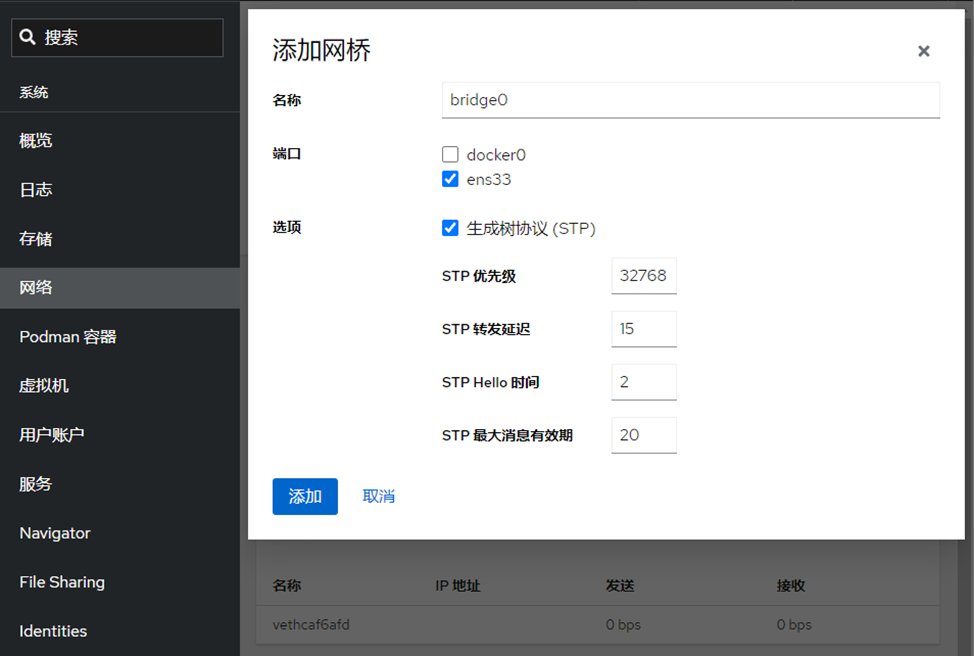
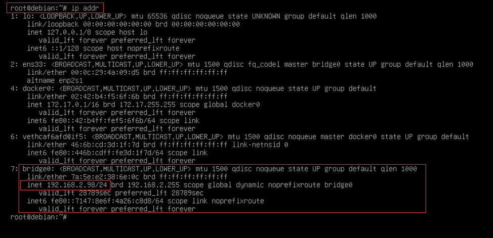
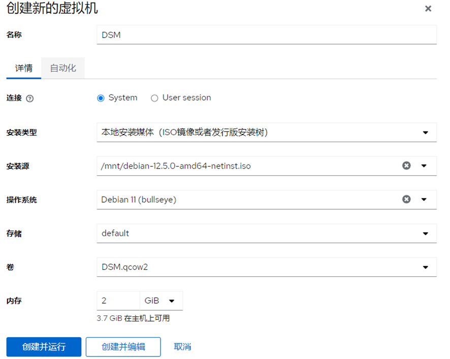
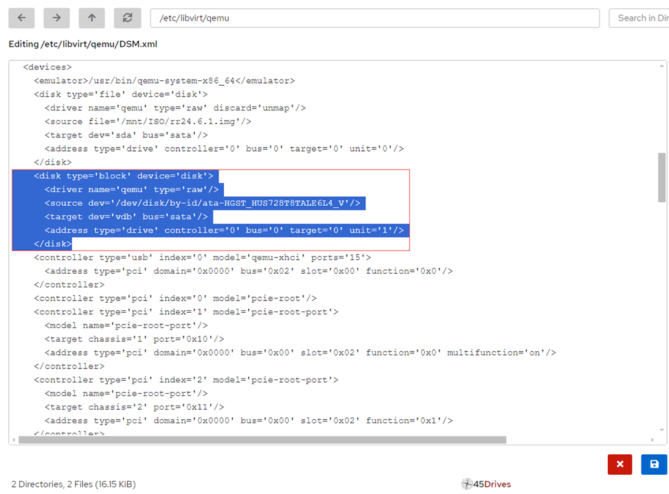
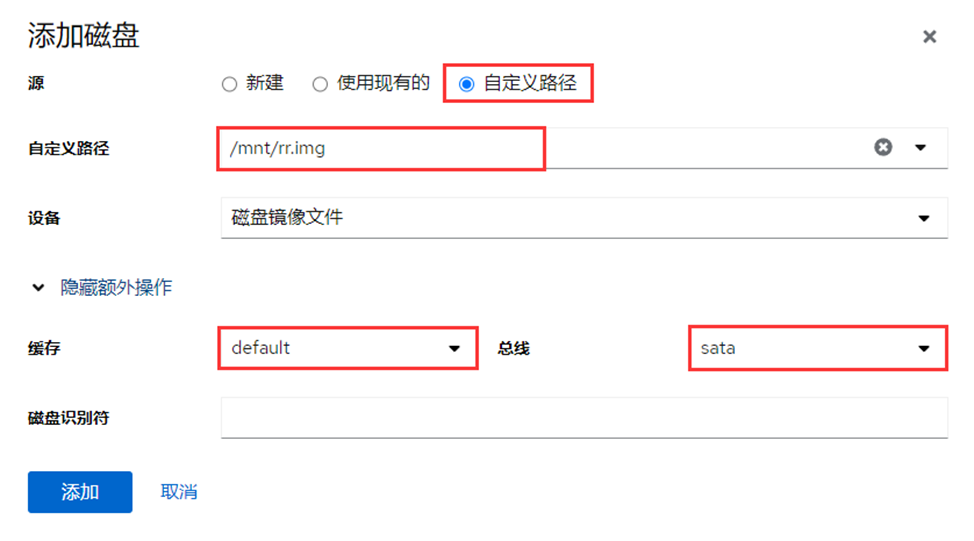
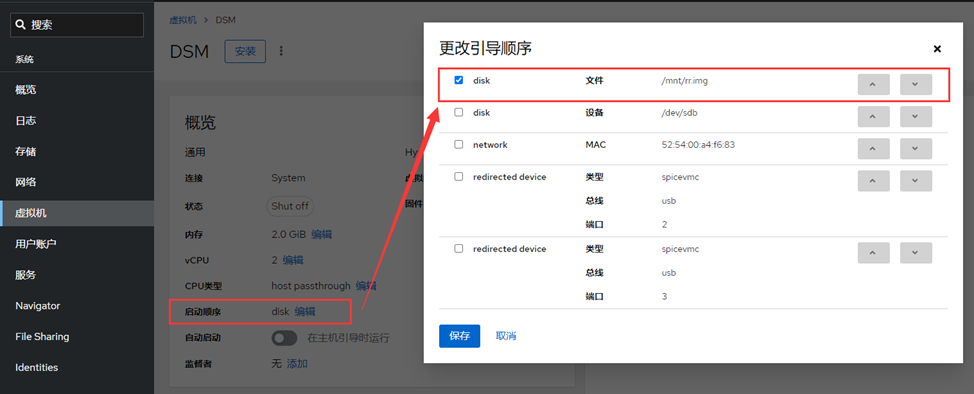
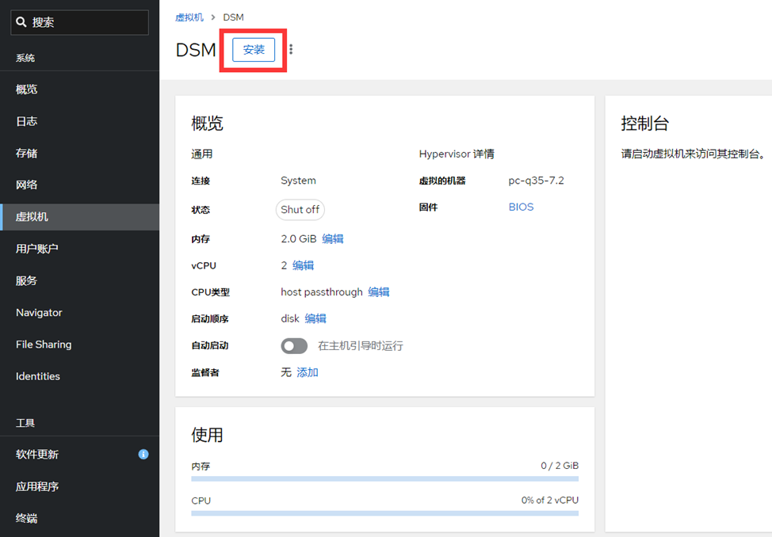
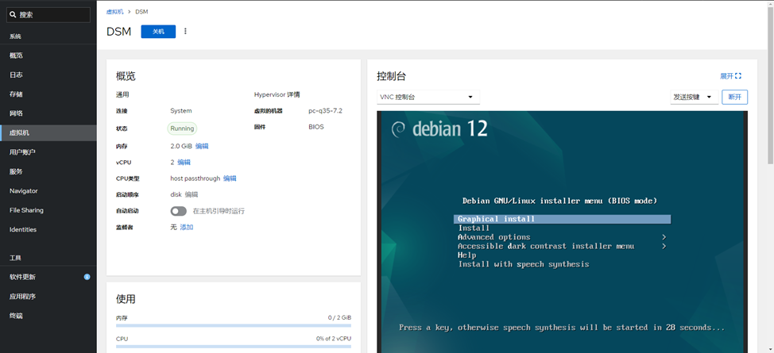
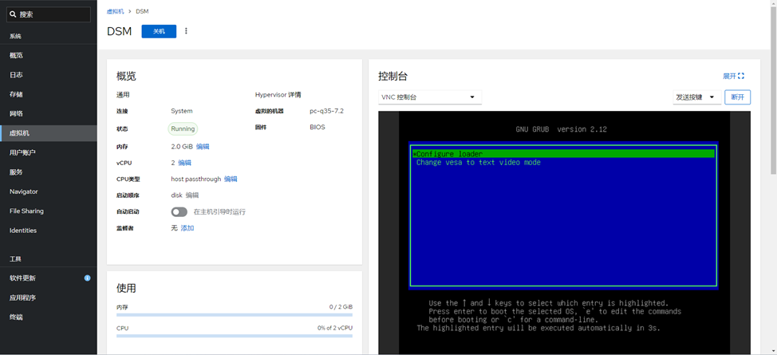

# Debian系统通过Cockpit面板直通硬盘安装黑群晖

## 一、开启IOMMU功能实现硬件直通

### 1.1、对于Intel CPU，添加 intel_iommu=on，操作如下：

```shell
vim /etc/default/grub
```

### 1.2、在里面找到：GRUB_CMDLINE_LINUX_DEFAULT="quiet"，然后修改为：

```shell
GRUB_CMDLINE_LINUX_DEFAULT="quiet intel_iommu=on iommu=pt i915.enable_guc=3 pcie_acs_override=downstream"
```

编辑完成后保存文件。

### 1.3、使用命令 update-grub 保存更改并更新grub

```shell
update-grub
```

### 1.4、加载直通内核模块

```shell
echo vfio >> /etc/modules
echo vfio_iommu_type1 >> /etc/modules
echo vfio_pci >> /etc/modules
echo vfio_virqfd >> /etc/modules
update-initramfs -u
```

### 1.5、更新完成后，使用重启系统

```shell
reboot now
```

### 1.6、验证是否开启IOMMU分组，命令：

```shell
dmesg | grep -e DMAR -e IOMMU
```

如果没有输出，则说明有问题。如果有,可基本确认这个过程顺利完成! 接下来就可以为虚拟机正常的添加硬件直通了。

如果没有直通硬件需求，安装群晖系统直接从第二步开始操作。

## 二、创建网桥并开启IP包的转发功能

### 2.1、创建网桥

**1、打开Cockpit管理面板——网络——添加网桥**


**2、选择你的物理网卡接口，勾选生成树协议（不勾也可以），点击添加。**



**3、完成网桥创建会分配新的IP地址（一般为当前IP地址加一，比如192.168.2.97变成192.168.2.98），请前往路由器后台或者主机控制台终端（需要显示器）查询，主机控制台终端查询命令：**

```shell
ip addr
```

**4、找到名称为bridge0的接口查看IP地址，如下图所示。**



## 2.2、开启IP包的转发功能

**1、编辑 sysctl.conf 文件：**

打开终端，并以 root 用户身份编辑 /etc/sysctl.conf 文件。

```shell
vim /etc/sysctl.conf
```

**2、取消注释或添加转发设置：**

在 sysctl.conf 文件中，找到以下行（如果不存在则添加）：

```shell
# Uncomment the next line to enable packet forwarding for IPv4
net.ipv4.ip_forward=1
```

删除行首的注释符号 # 或者手动添加这一行。这将启用 IPv4 包转发。

**3、应用更改：**

保存并关闭文件后，使用以下命令使更改生效：

```shell
sysctl -p
```

重启系统。

**4、验证：**

您可以使用以下命令验证 IP 包转发是否已成功启用：

```shell
sysctl net.ipv4.ip_forward
```

如果输出为 `net.ipv4.ip_forward = 1`，则表示转发功能已启用。

通过完成以上步骤，您应该已经成功启用了 Debian 系统上的 IP 包转发功能。

## 三、创建群晖虚拟机

### 1、创建虚拟机，这里安装源必须先设置为Debian系统的镜像，如果没有，去Debian官网下载一个。地址：https://www.debian.org/


**下载好的镜像文件上传到/mnt目录下。**



硬件配置根据自己主机性能配置，丰俭由人。完成基础硬件配置后，点击创建并编辑。

这是创建好之后的界面，提醒一句，安装群晖系统，这里固件模式，必须是BIOS。


### 2、添加直通硬盘

确定磁盘信息：

使用以下命令找到要直通的磁盘的信息：

```shell
ls -l /dev/disk/by-id/
```

找到你要直通的硬盘信息


编辑DSM.xml配置文件

```shell
vim /etc/libvirt/qemu/DSM.xml
```

添加裸磁盘设备：在 `<devices>` 标签内部，添加一个 `<disk>` 元素，将裸磁盘的路径设置为 `<source>` 的属性，并将设备类型设置为 disk，如下所示：

```shell
<disk type='block' device='disk'>
  <driver name='qemu' type='raw'/>
  <source dev='/dev/disk/by-id/ata-HGST_HUS728T8TALE6L4_V'/>
  <target dev='vdb' bus='sata'/>
</disk>
```

确保将 dev 属性设置为虚拟机内部将使用的设备名称，例如 vdb。bus 属性设置为sata表示使用sata接口，群晖只支持sata接口。

保存并退出：保存对配置文件的修改并退出编辑器。

重启虚拟机服务，执行命令：

```shell
sudo systemctl restart libvirtd
```

以确保新的配置生效。

检查：使用 `virsh dumpxml dsm` 确认修改是否成功应用。

通过以上步骤，你应该能够将裸磁盘直通给虚拟机。请确保在进行此操作时备份重要数据，以免意外数据丢失。



Cockpit管理面板需要刷新一下页面才能呈现出来直通的硬盘。


### 3、添加群晖引导

找到磁盘——添加磁盘




源：自定义路径

自定义路径：/mnt/rr.img（群晖引导的文件路径，可以放在其他位置）

设备：磁盘镜像文件

缓存：default

总线：sata（必须是这个）

如果你不需要这个虚拟磁盘，可以现在删除掉。


更改引导顺序，将群晖引导勾选上并调整至第一位。



点击安装，系统将开机



如果你点击安装之后，跑出来的是Debian系统的安装界面，请点击关机，然后将Debian系统的安装镜像移除，然后再开机安装群晖，如下图所示。



删除Debian系统安装镜像


确认删除


如果你是直接进去RR引导界面，则后续步骤按常规安装群晖的教程走下去即可。



## 教程结束！
