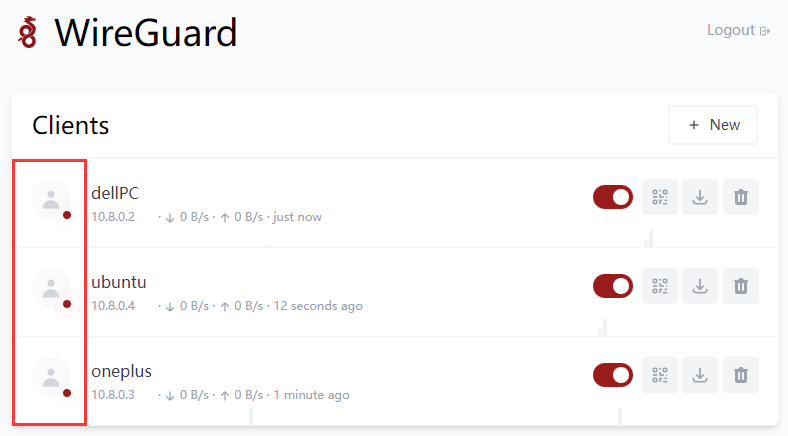

# 系统调优
## 1、设置Cockpit接管网络配置
编辑文件网络配置文件，命令：
```
sudo vim /etc/network/interfaces
```
添加 `#` 符号注释掉里面所有参数：
```
# This file describes the network interfaces available on your system
# and how to activate them. For more information, see interfaces(5).
# source /etc/network/interfaces.d/*
# The loopback network interface
# auto lo
# iface lo inet loopback
# The primary network interface
# allow-hotplug enp1s0
# iface enp1s0 inet dhcp
```
**手动配置IP**
Cockpit-网络-接口- enp1s0 (你网络接口名称)-IPV4-编辑-手动，输入你要设置的IP地址及默认网关。
## 2、调整系统时区/时间
Cockpit-概览-系统时间-点击时间进行校准，时区选择Asia/Shanghai，设置时间选择自动使用NTP，然后点击变更，系统会自动联网进行校准。
## 3、交换空间优化
Debian默认是当内存使用达到**40%就向交换空间写入数据，这样会大大的降低电脑运行效率，我们将它改为10%**再向交换空间写入数据
打开 `/etc/sysctl.conf `文件，执行命令：
```
sudo vim /etc/sysctl.conf
```
在文件的末尾添加下面两行配置：
```
vm.swappiness=10
vm.vfs_cache_pressure=50
```
`vm.swappiness` 是用来控制内核在什么时候开始使用交换空间的参数，默认值是 60。将该值调整为 10 表示让内存使用率达到 90% 时才开始使用交换空间。
`vm.vfs_cache_pressure` 是用来控制内核清理缓存的频率的参数，默认值是 100。将该值调整为 50 表示内核会更倾向于清理文件系统缓存以回收内存。
保存修改并退出编辑器,执行命令：
```
sudo sysctl -p
```
以重新加载配置。
注意：修改内核参数可能会影响系统性能和稳定性，请根据自身需要调整，谨慎操作。
## 4、安装Tuned系统调优工具
Tuned（又称为tuned-adm）是一个系统调优工具，旨在帮助优化系统的性能和功耗。它允许管理员根据系统的需求选择不同的预定义配置文件或自定义配置文件，以提供最佳的性能和功耗平衡。
安装Tuned软件包
```
sudo apt update && sudo apt install tuned
```
以下是Tuned的一些常用命令和其功能：
```
sudo systemctl start tuned     # 启动Tuned服务。
sudo systemctl stop tuned      # 停止Tuned服务。
sudo systemctl restart tuned   # 重启Tuned服务。
sudo systemctl status tuned    # 查看Tuned服务的运行状态。
sudo systemctl stop tuned      # 停止Tuned服务。
sudo systemctl disable tuned   # 禁止Tuned服务开机启动。
tuned-adm list                 # 列出所有可用的Tuned配置文件。
tuned-adm active               # 查看当前活动的Tuned配置文件。
tuned-adm recommend            # 根据系统的硬件配置和工作负载推荐一个最佳的Tuned配置文件。
```
在Cockpit Web管理面板上配置Tuned

选择你需要的模式激活使用

**常用TuneD 配置集**

**1、throughput-performance**
针对高吞吐量优化的服务器配置文件。它禁用节能机制并启用 sysctl 设置，以提高磁盘和网络 IO 的吞吐量性能。
> CPU 调控器设置为 performance。它将 energy_performance_preference 和 scaling_governor 属性设置为 performance 配置集。

**2、accelerator-performance**
accelerator-performance 配置集包含与 throughput-performance 配置集相同的调整。
> 另外，它会将 CPU 锁定为低 C 状态，以便使延迟小于 100us。这提高了某些加速器的性能，如 GPU。

**3、network-throughput**
用于吞吐量网络调优的配置集。
> 它基于 throughput-performance 配置集。此外，它还增加了内核网络缓冲区。它继承 latency-performance 或 throughput-performance 配置集，并将energy_performance_preference 和 scaling_governor 属性改为 performance 配置集。

**4、Balanced**
默认的节能配置文件。它在性能和功耗之间具有折衷。在可能的情况下尽可能使用自动扩展和自动调整。唯一缺陷是增加延迟。
> 在当前的 TuneD 版本中，它启用了 CPU、磁盘、音频和视频插件，并激活了 conservative CPU 调控器。如果支持，radeon_powersave 选项使用 dpm-balanced 值，否则被设置为 auto。它将 energy_performance_preference 属性改为 normal 能源设置。它还将 scaling_governor 策略属性改为 conservative 或 powersave CPU 调控器。

**5、powersave**
用于最大节能性能的配置集。它可以对性能进行调整，从而最大程度降低实际功耗。
> 在当前的 TuneD 发行版本中，它为 SATA 主机适配器启用 USB 自动挂起、WiFi 节能和 Aggresive Link Power Management (ALPM) 节能。它还为使用低折率的系统调度多核功耗，并激活 ondemand 监管器。它启用了 AC97 音频节能，或根据您的系统，HDA-Intel 节能时间为 10 秒。如果您的系统包含启用了 KMS 支持的 Radeon 图形卡，配置集会将其配置为自动节能。在 ASUS Eee PC 上，启用了动态超级混合引擎。它将 energy_performance_preference 属性改为 powersave 或 power energy 设置。它还会将 scaling_governor 策略属性更改为 ondemand 或 powersave CPU 调控器。

## 5、新用户默认加入user组
编辑`/etc/adduser.conf`文件，
找到 USERGROUPS 修改变量为 'no'（USERGROUPS=no）, 这样当创建用户时就不会伴随产生一个新组了.设置 USERS_GID 为所有用户都属于的组的GID，建议设置为USERS_GID=100，即user组。
这样修改好之后，新建用户将不再生成同名用户组，且用户默认加入user组。

## 6、修改homes目录默认路径
编辑/etc/adduser.conf文件，
找到DHOME=/home参数，修改变量为自定义路径即可，例如：
```
DHOME=/srv/volume_1/data/home
```

## 7、修改用户home目录默认权限
编辑`/etc/adduser.conf`文件，
找到DIR_MODE=0755参数，修改变量为'0700'（DIR_MODE=0700），0700表示只有该用户拥有文件所有权，其他用户无权访问。

## 8、创建新用户
对于需要创建新的用户，推荐通过adduser命令去增加，只有通过这个命令去增加的用户，前面4.3~4.6之间的修改项方能生效。
创建新用户命令，命令中的”test”为用户名，自行替换为自己需要创建的用户名：
```
sudo adduser test
```
系统将输出如下内容：
```
正在添加用户"test"...
正在添加新用户"test" (1001) 到组"users"...
创建主目录"/srv/home/test"...
正在从"/etc/skel"复制文件...
新的 密码：
重新输入新的 密码：
passwd：已成功更新密码
正在改变 test 的用户信息
请输入新值，或直接敲回车键以使用默认值
        全名 []: test
        房间号码 []: 
        工作电话 []: 
        家庭电话 []: 
        其它 []: 
这些信息是否正确？ [Y/n] y
```
创建用户过程中，需要填写新创建用户的密码，建议全名项输入与用户名相同的值，其余项可以留空，或者按需填写。
adduser高级语法可以参考此链接：https://www.runoob.com/linux/linux-comm-adduser.html
## 9、创建容器专属账户
考虑到将要搭建的容器服务众多，甚至一部分服务还可能对 Internet 开放，为了安全，建议创建一个专用的低权限用户来运行各项容器。
```
sudo adduser application
```
使用命令行新建名为 application 的用户(名称可以自定义)：
```
id application
```
终端输出内容：
```
uid=1001(application) gid=1001(application) 组=1001(application)
```
这里可以看到都是：1001（application），记住这个值，作为后续容器参数使用。
## 10、配置邮件发送服务
安装Exim4，命令：
```
sudo apt install exim4 -y
```
配置Exim4服务，命令：
```
sudo dpkg-reconfigure exim4-config
```
终端输出配置内容：
```
Please select the mail server configuration type that best meets your needs.

Systems with dynamic IP addresses, including dialup systems, should generally be
configured to send outgoing mail to another machine, called a 'smarthost' for
delivery because many receiving systems on the Internet block incoming mail from
dynamic IP addresses as spam protection.

A system with a dynamic IP address can receive its own mail, or local delivery
can be disabled entirely (except mail for root and postmaster).

  1. internet site; mail is sent and received directly using SMTP
  2. mail sent by smarthost; received via SMTP or fetchmail
  3. mail sent by smarthost; no local mail
  4. local delivery only; not on a network
  5. no configuration at this time
General type of mail configuration:
```
接下来进行逐步配置：

1、邮件系统设置的常见类型：选择第三项，用smarthost 发信；无本地信件。
```
General type of mail configuration: 3
```

2、系统邮件名称：填写发邮件的邮件域名，如你的发件邮件地址是mymail@qq.com，则这里填写qq.com。
```
system mail name:qq.com
```

3、要监听入站 SMTP 连接的 IP 地址：填127.0.0.1 ; ::1，这里表示只监听本地IPV4/IPV6端口，也就是只有本机能发信，外部不能访问。
```
IP-addresses to listen on for incoming SMTP connections: 127.0.0.1 ; ::1
```

4、其它可接收邮件的目的地址：留空
```
Other destinations for which mail is accepted:
```

5、本地用户的可见域名：这里和第2步一样，填写你的发件邮箱域名，如qq.com。
```
Visible domain name for local users: qq.com
```

6、发邮件使用的smarthost 的IP 地址或主机名：填写外部SMTP地址。由于qq.com使用的邮件系统是qq，所以这里填写qq的smtp地址`smtp.qq.com:587`。
```
IP address or host name of the outgoing smarthost: smtp.qq.com:587
```

7、保持最小 DNS 查询量吗 (按需拔号，Dial-on-Demand)？否
```
Keep number of DNS-queries minimal (Dial-on-Demand)? [yes/no] n
```

8、将设置文件分拆成小文件吗？否（不搭建复杂的邮件服务器，保持默认就可以，不需要拆分）
```
Split configuration into small files? [yes/no] n
```

9、Root 和 postmaster 邮件的接收者: 空
```
Root and postmaster mail recipient:
```

到这里就完成了，但还不能发邮件。输入命令：
```
sudo vim /etc/exim4/passwd.client
```
在末尾加入(注意修改用户名和密码,密码为邮箱授权码，非登录密码)：
```
qq-smtp.l.qq.com:yourAccountName@qq.com:y0uRpaSsw0RD
*.qq.com:yourAccountName@qq.com:y0uRpaSsw0RD
smtp.qq.com:yourAccountName@qq.com:y0uRpaSsw0RD
```
格式为：发件邮箱SMTP服务器:发件邮箱账号:发件邮箱密码，因为上面我们已经设置smtp服务器地址，所以这里可以填写通配符，当然也可以填smtp地址。
输入命令：
```
sudo vim /etc/email-addresses
```
在末尾加入：
```
root: mymail@qq.com
```
格式是：系统用户名: 发件邮箱地址。
防火墙记得开放587端口，然后重启exim4，输入命令：
```
/etc/init.d/exim4 restart
```
发送邮件测试，首先切换到root用户，输入命令：
```
su –
```
输入发送邮件测试命令(user@example.com改为你要接收邮件的邮箱地址)：
```
sudo echo "test" | mail -s "test" user@example.com
```
如果你的邮箱收到邮件，就说明安装成功了。

## 11、添加Github Hosts
打开系统hosts文件，命令：
```
sudo vim /etc/hosts
```
粘贴下面内容进去之后保存退出即可。（此Hosts IP具有时效性，请保持定期更新）
```
# GitHub Host Start
140.82.113.3                 central.github.com
140.82.113.3                 assets-cdn.github.com
151.101.1.6                  github.map.fastly.net
151.101.1.6                  github.global.ssl.fastly.net
140.82.113.3                 gist.github.com
185.199.108.153              github.io
140.82.113.3                 github.com
140.82.113.3                 api.github.com
140.82.113.3                 codeload.github.com
72.21.206.80                 github-cloud.s3.amazonaws.com
72.21.206.80                 github-com.s3.amazonaws.com
72.21.206.80                 github-production-release-asset-2e65be.s3.amazonaws.com
72.21.206.80                 github-production-user-asset-6210df.s3.amazonaws.com
72.21.206.80                 github-production-repository-file-5c1aeb.s3.amazonaws.com
185.199.108.153              githubstatus.com
140.82.113.18                github.community
140.82.113.3                 raw.github.com
# Update at: 2022-11-19 18:13:32
# GitHub Host End
```
（来源：https://gitlab.com/ineo6/hosts/-/raw/master/next-hosts）
## 12、添加TMDB Hosts
打开系统hosts文件，命令：
```
sudo vim /etc/hosts
```
粘贴下面内容进去之后保存退出即可。（此Hosts IP具有时效性，请保持定期更新）
```
# TMDB Hosts Start
3.171.38.13 themoviedb.org
3.171.38.80 themoviedb.org
3.171.38.81 themoviedb.org
3.171.38.90 themoviedb.org
18.160.200.6 tmdb.org
18.160.200.13 tmdb.org
18.160.200.56 tmdb.org
18.160.200.103 tmdb.org
3.171.38.13 www.themoviedb.org
3.171.38.80 www.themoviedb.org
3.171.38.81 www.themoviedb.org
3.171.38.90 www.themoviedb.org
52.85.247.30 api.themoviedb.org
52.85.247.33 api.themoviedb.org
52.85.247.69 api.themoviedb.org
52.85.247.81 api.themoviedb.org
3.167.112.56 api.tmdb.org
3.167.112.59 api.tmdb.org
3.167.112.71 api.tmdb.org
3.167.112.111 api.tmdb.org
169.150.236.98 image.tmdb.org
158.69.0.103 assets.fanart.tv
192.99.151.161 assets.fanart.tv
# Update at 20250216
# TMDB Hosts End
```
获取最新IP方法：通过[ipaddress](https://www.ipaddress.com "ipaddress")或者[dnschecker](https://dnschecker.org/country/cn "dnschecker")首页，输入`api.themoviedb.org`和`api.tmdb.org`获取真实IP地址
## 13、WireGuard家庭组网
WireGuard®是一个极其简单而又快速的现代VPN，采用了最先进的加密技术。它的目标是比IPsec更快、更简单、更精简、更有用，同时避免了大量的头痛问题。它打算比OpenVPN的性能要好得多。WireGuard被设计成一个通用的VPN，可以在嵌入式接口和超级计算机上运行，适合于许多不同的情况。它最初是为Linux内核发布的，现在是跨平台的（Windows、macOS、BSD、iOS、Android），可广泛部署。它目前正在大力发展，但已经被认为是业内最安全、最容易使用和最简单的VPN解决方案。

> 官网：https://www.wireguard.com/
> 
> Docker版项目地址：https://hub.docker.com/r/weejewel/wg-easy
> 
> 各平台客户端下载地址：https://www.wireguard.com/install/

一、WireGuard部署
这里采用Docker部署WireGuard的原因是因为，是因为Docker版提供了WebUI界面，可通过图形界面即可完成WireGuard的相关连接配置，使用起来方便快捷，对新手友好。
Docker CLI部署命令：
```
docker run -d \
  --name=wg-easy \
  -e WG_HOST=123.123.123.123 (服务器公网IP或域名地址，无需端口) \
  -e PASSWORD=passwd123 (Web管理面板密码) \
  -e WG_DEFAULT_ADDRESS=10.8.0.x （默认IP地址）\
  -e WG_DEFAULT_DNS=223.5.5.5 （默认DNS）\
  -e WG_ALLOWED_IPS=10.8.0.0/24 （允许连接的IP段）\
  -e WG_PERSISTENT_KEEPALIVE=25 （重连间隔）\
  -v ~/.wg-easy:/etc/wireguard （配置文件保存路径）\
  -p 51820:51820/udp \
  -p 51821:51821/tcp \
  --cap-add=NET_ADMIN \
  --cap-add=SYS_MODULE \
  --sysctl="net.ipv4.conf.all.src_valid_mark=1" \
  --sysctl="net.ipv4.ip_forward=1" \
  --restart unless-stopped \
  weejewel/wg-easy
```
容器部署完成后，即可通过`http://localhost:51821访问`
二、路由器转发UDP端口
因为我是在家里的用的公网IP宽带做服务端，所以需要在路由器上转发UDP端口，按照上面的配置信息，设置的UDP端口是：51820，所以需要转发这个端口，51821是webUI访问端口，可发。下图是华硕路由器设置端口转发示意图：

三、创建设备连接
1、点击New Client创建新的连接客户端。

2、在弹出的New Client框中，Name部分内容可以随意填写，一般情况下，建议以使用的设备名称来命令，以方便后期设备多了之后，便于快速区分。比如设置为：xiaomi、oneplus、dellPC、hpPC等等。

3、获取连接的配置文件或配置信息

4、PC端连接，打开安装好的WireGuard客户端，点击从文件导入隧道，选择刚刚下载的dellPC.conf文件，点击打开即可。

打开之后点击：连接，即可和WireGuard服务端连接上。

5、Debian系统上连接，
安装WireGuard，可以通过以下命令完成：
```
sudo apt update
sudo apt install -y wireguard resolvconf
```
在客户端上创建配置文件 在客户端上，您需要创建一个配置文件，其中包含服务器的公共IP地址和端口，以及客户端的公钥和私钥。您可以使用以下命令创建配置文件：
```
sudo vim /etc/wireguard/wg0.conf
```
在编辑器中，输入刚才下载ubuntu.conf文件里的内容(.conf文件可通过Windows系统的记事本打开)：
```

[Interface]
PrivateKey = AMgQmLbE4GrjahPOvm56CEHd/hIlovG2atNW5Wotq28=
Address = 10.8.0.4/24
DNS = 223.5.5.5


[Peer]
PublicKey = O/4gWMVbNLFpwbnFQCUpJV3g3oCPSV0wjqDaaEAqnyw=
PresharedKey = LojEYv08DXKi31R7jErWDOCexdw15/VsIyt4rg6/7B8=
AllowedIPs = 10.8.0.0/24
PersistentKeepalive = 25
Endpoint = baidu.com:51820
Endpoint = baidu.com:51820，这里可以填写你服务器的公网IP或者域名，如果是动态公网IP，建议填写域名。
```
启动WireGuard客户端 在客户端上，您需要启动WireGuard客户端，这可以通过以下命令完成：
启用 wg-quick 服务，并在系统启动时自动启动该服务。
```
sudo systemctl enable wg-quick@wg0
```
启动 wg-quick 服务，使 WireGuard VPN 服务开始运行。
```
sudo systemctl start wg-quick@wg0
```
现在，您的Ubuntu系统已经成功连接到您在云服务器上部署的WireGuard服务，您可以通过以下命令来检查连接状态：
```
sudo wg
```
如果一切正常，您将看到类似以下输出：
```

interface: wg0
  public key: rT90PdlG+Et5thj/uKrXlIpuZa0edWpYt2kEaUdVkE0=
  private key: (hidden)
  listening port: 42262

peer: O/4gWMVbNLFpwbnFQCUpJV3g3oCPSV0wjqDaaEAqnyw=
  preshared key: (hidden)
  endpoint: 192.137.59.59:51820
  allowed ips: 10.8.0.0/24
  latest handshake: 1 hour, 13 minutes, 44 seconds ago
  transfer: 53.51 KiB received, 428.10 KiB sent
  persistent keepalive: every 25 seconds
```
如果您想禁用WireGuard VPN开机自启动，可以使用以下命令：
```
sudo systemctl disable wg-quick@wg0
```
请注意，上面命令不会停止当前正在运行的WireGuard VPN服务，如果您当前正在运行WireGuard VPN服务，您可以使用以下命令来停止它：
```
sudo wg-quick down wg0
```
这将关闭 wg0 接口并停止WireGuard VPN服务。
如果您已经使用` sudo systemctl start wg-quick@wg0` 命令启动了 WireGuard VPN 服务，则可以使用以下命令停止服务：
```
sudo systemctl stop wg-quick@wg0
```
这将停止 `wg-quick@wg0` 服务并关闭 wg0 接口。
6、手机端连接，手机端连接很简单，安装好WireGuard手机端app之后，打开app点击右下角的+号按钮——选扫描二维码，扫描WebUI端提供的二维码即可连接成功(扫描成功后会弹出框提示输入名称，这个名称可以随意填写，比如设置为：WireGuard)。

当设备连接成功后，WebUI界面可查看其状态，头像右下角显示有红点，表示连接正常。
