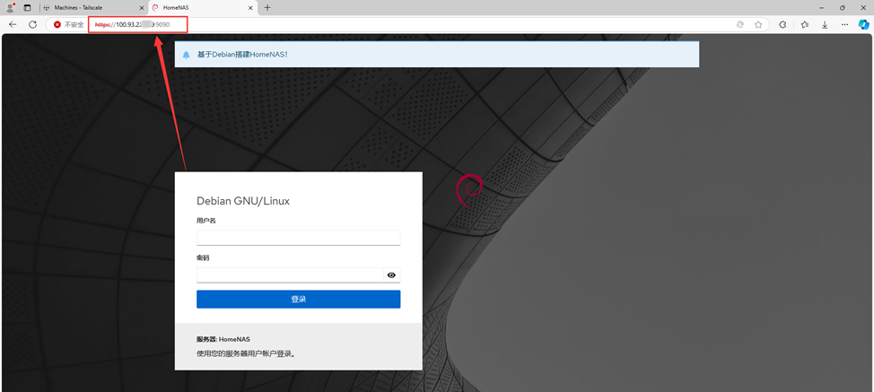

# 内网穿透服务Tailscale安装使用教程
## 前言：
Tailscale属于一种虚拟组网工具,基于WireGuard。他能帮助我们把安装了Tailscale服务的机器,都放到同一个局域网。  

Tailscale免费提供内网穿透服务，速度不是很快，所以期望不要太高。但用来管理服务器，进行一些基础操作是没有问题。对于完全没有办法获取到公网IP的用户，也是一种福音。  

原创文章，转载请保留出处：https://github.com/kekylin/Debian-HomeNAS

## 一、安装Tailscale
### 1.1、复制脚本运行命令
项目地址：https://github.com/kekylin/Debian-HomeNAS  
国内用户
  ```shell
SUDO=$(command -v sudo || echo "") ; $SUDO bash -c "$(wget -qO- https://gitee.com/kekylin/Debian-HomeNAS/raw/test/Shell/start.sh)"
  ```
Github直连
  ```shell
SUDO=$(command -v sudo || echo "") ; $SUDO bash -c "$(wget -qO- https://raw.githubusercontent.com/kekylin/Debian-HomeNAS/refs/heads/test/Shell/start.sh)"
  ```
### 1.2、启动脚本


### 1.3、安装Tailscale


## 二、安装完成，绑定设备
### 2.1、复制绑定设备链接


### 2.2、登陆账户绑定设备


### 2.3、点击Connect绑定


### 2.4、绑定成功


### 2.5、查看账户下所有绑定设备


## 三、安装移动端或PC端应用
### 3.1、下载安装客户端
官网下载地址：https://tailscale.com/download


### 3.2、打开客户端


### 3.3、登陆你的tailscale账户


### 3.4、点击Connect完成绑定


## 四、连接使用
#### **Tailscale是点对点服务，使用时需两边客户端都处于连线状态才能进行互联。**  

1、以访问Debian系统服务为例，复制Debian设备IP地址，在浏览器中输入：IP地址+服务端口号即可打开对应服务。


2、IP地址+服务端口号，访问成功。


#### **手机客户端使用操作与PC端相同，安装客户端——登陆账户——绑定设备——访问Debian系统。**  

更多Tailscale高级玩法，请自行百度查找资料。或参考B站“韩风Talk”大佬视频。  
地址：【Tailscale玩法之内网穿透、异地组网、全隧道模式、纯IP的双栈DERP搭建、Headscale协调服务器搭建，用一期搞定，看一看不亏吧？】  
https://www.bilibili.com/video/BV1Wh411A73b
